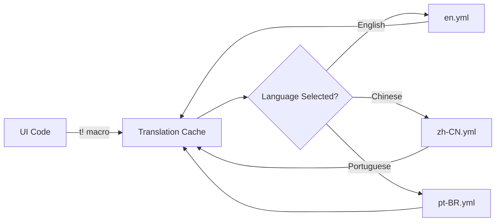

Pulsar ships with a translation system that lets you build games for a global audience without worrying about hardcoded English strings. The entire active language loads into memory at startup, providing nanosecond-level translation lookups with zero I/O overhead. When players switch languages via the titlebar dropdown, every visible string updates immediately—menus, buttons, tooltips, everything.

## The Problem With Traditional Localization

Most game engines treat localization as an afterthought. You ship your game with English strings hardcoded everywhere, then months later realize you need to support Chinese, Spanish, Portuguese. At that point, you're faced with finding every single UI string across dozens of files and replacing them with translation keys. It's tedious, error-prone work that delays your international launch.

Pulsar bakes localization into the UI framework from day one. Instead of writing `"New Project"` directly in your menu code, you write `t!("Menu.File.NewProject")`. The translation macro looks up the appropriate string for the current language. When you add support for a new language, you just create a new YAML file with translations—no code changes required. The engine handles everything else.

## Architecture Overview

The translation system has three cooperating parts. **YAML translation files** store all translatable strings, with one file per language per crate. Files sit in `locales/` directories next to the Rust code they translate. **rust-i18n** parses these files at compile time and embeds efficient lookup tables directly into the binary. The **`t!` macro** provides the API—you call `t!("Some.Key")` and get back the translated string in nanoseconds.



When you call `t!("Menu.File.Save")`, the macro performs a constant-time hash lookup in the loaded language cache. If the key exists, you get back the translated string. If not, you get the fallback English text. No file access, no network calls, no delays—just a memory read.


*The language selector in the main titlebar. Click it to instantly switch languages—all visible UI text updates immediately without restarting the engine.*

## File Organization

Each crate that needs translations maintains a `locales/` directory. Inside, you have one YAML file per supported language. Pulsar currently ships with five languages:

- `en.yml` - English (fallback language)
- `it.yml` - Italian
- `pt-BR.yml` - Portuguese (Brazil)
- `zh-CN.yml` - Simplified Chinese
- `zh-HK.yml` - Traditional Chinese

The YAML structure mirrors your UI hierarchy:

```
ui-crates/ui_level_editor/locales/
├── en.yml       # English translations
├── zh-CN.yml    # Simplified Chinese
├── zh-HK.yml    # Traditional Chinese
├── it.yml       # Italian
└── pt-BR.yml    # Brazilian Portuguese
```

Each file contains only translations for that specific language, using a hierarchical key structure:

```yaml
# en.yml
_version: 2

LevelEditor:
  Toolbar:
    StartSimulation: "Start Simulation (F5)"
    StopSimulation: "Stop Simulation (Shift+F5)"
    PauseSimulation: "Pause Simulation"
  Hierarchy:
    Title: "Hierarchy"
    AddObject: "Add Object"
  Properties:
    Title: "Properties"
    NoSelection: "No Selection"
```

```yaml
# zh-CN.yml
_version: 2

LevelEditor:
  Toolbar:
    StartSimulation: "开始模拟 (F5)"
    StopSimulation: "停止模拟 (Shift+F5)"
    PauseSimulation: "暂停模拟"
  Hierarchy:
    Title: "层级"
    AddObject: "添加对象"
  Properties:
    Title: "属性"
    NoSelection: "未选择"
```

The key structure uses YAML nested hierarchies (not dot notation in the file). The `rust-i18n` library flattens these into dot-notation keys at compile time, so `LevelEditor.Toolbar.StartSimulation` becomes the lookup key.

Language codes follow the ISO 639-1 standard (`en` for English) with optional region codes (`zh-CN` for Simplified Chinese, `zh-HK` for Traditional Chinese, `pt-BR` for Brazilian Portuguese). The system falls back to English if a translation is missing, ensuring the UI never shows raw key names.

## Using Translations in Code

The `t!()` macro provides the primary interface for retrieving translations. Import `rust_i18n::t` and use it anywhere you need translated text:

```rust
use rust_i18n::t;

// In a button tooltip
Button::new("play")
    .icon(IconName::Play)
    .tooltip(t!("LevelEditor.Toolbar.StartSimulation"))

// In a panel title
div()
    .text_base()
    .font_weight(FontWeight::SEMIBOLD)
    .child(t!("LevelEditor.Hierarchy.Title").to_string())
```

The macro returns a `Cow<'static, str>`, which is either a borrowed static string or an owned String. Most GPUI methods accept `Cow<str>` directly for tooltips and labels. For inline text that requires `IntoElement`, call `.to_string()` to convert to a String. The compiler will optimize this appropriately—if the translation is a static string, the conversion becomes a copy rather than an allocation.

For functions that need the current or change languages:

```rust
use ui_level_editor::{locale, set_locale};

// Get current language
let current = locale(); // Returns "en", "zh-CN", etc.

// Change language
set_locale("zh-CN");

// UI updates automatically on next render
window.refresh();
```

The `set_locale` function swaps the active translation HashMap immediately. Any `t!()` calls after this point will return strings in the new language. Calling `window.refresh()` triggers a redraw, updating all visible text.

## Initializing Translations

Each crate that contains translations must initialize the `rust-i18n` system. This happens once at crate load time using a macro invocation:

```rust
// At the top of lib.rs in ui_level_editor or ui_common
rust_i18n::i18n!("locales", fallback = "en");

pub fn locale() -> String {
    rust_i18n::locale().to_string()
}

pub fn set_locale(locale: &str) {
    rust_i18n::set_locale(locale);
}
```

The `i18n!` macro scans the `locales/` directory at compile time, parsing all YAML files. The `fallback` parameter tells it to use English when a key doesn't exist in the active language. This guarantees developers always see readable text, even for incomplete translations.

The convenience functions wrap `rust-i18n`'s API, providing a cleaner interface and hiding the dependency from the rest of your code.

## Using Translations in UI Code

The `t!` macro retrieves translated strings. Import it and use it wherever you need localized text:

```rust
use rust_i18n::t;

// Button tooltip
Button::new("play")
    .icon(IconName::Play)
    .tooltip(t!("LevelEditor.Toolbar.StartSimulation"))

// Panel title  
div()
    .child(t!("LevelEditor.Hierarchy.Title").to_string())

// Menu items
MenuItem::action(t!("Menu.File.New").to_string(), NewProject)
```

The macro returns `Cow<'static, str>`, which is either a borrowed static string or an owned String. Most GPUI methods accept `Cow<str>` directly for tooltips and labels. For inline text in elements that need `IntoElement`, call `.to_string()` to convert. The compiler optimizes this—if the translation is static, conversion becomes a copy instead of allocation.

When you need to check or change the current language:

```rust
use ui_level_editor::{locale, set_locale};

// Get current language
let current = locale(); // Returns "en", "zh-CN", etc.

// Change language
set_locale("zh-CN");

// Trigger UI refresh to show new language
cx.refresh();
```

The `set_locale` function swaps the active translation cache immediately. All subsequent `t!()` calls return strings in the new language. Refreshing the UI redraws everything with updated text.

## Key Naming Conventions

Translation keys follow a hierarchical pattern that mirrors your UI structure. This makes keys predictable and reduces the chance of collisions:

```yaml
Component:
  Section:
    Element: "Translation"

# Examples
LevelEditor:
  Toolbar:
    StartSimulation: "Start Simulation (F5)"
  Hierarchy:
    AddObject: "Add Object"
  Properties:
    NoSelection: "No Selection"
  Viewport:
    CameraMode: "Camera Mode"

Menu:
  File:
    New: "New"
    Open: "Open..."
    Save: "Save"
```

The first level identifies the major component (`LevelEditor`, `Menu`, `SettingsPanel`). The second level narrows to a specific panel or feature (`Toolbar`, `Hierarchy`, `File`). The final level describes the actual UI element (`StartSimulation`, `AddObject`, `New`).

Common patterns:
- **Buttons**: `{Component}.{Section}.{Action}` → `LevelEditor.Toolbar.Play`
- **Labels**: `{Component}.{Section}.{Name}` → `LevelEditor.Properties.Transform`  
- **Tooltips**: Same key as the element they describe
- **Messages**: `{Component}.{Section}.{MessageType}` → `LevelEditor.Properties.NoSelection`

Consistency in naming helps translators understand context and helps developers find the right keys.

## Performance Characteristics

The translation system has zero runtime overhead. At engine startup, `rust-i18n` loads the active language's translations into a HashMap in static memory. Each `t!()` call becomes a single hash lookup—typically 10-20 nanoseconds. No file I/O, no allocations, no blocking.

```rust
// The t!() macro compiles down to approximately this:
static TRANSLATIONS: HashMap<&str, &str> = /* ... */;

pub fn t(key: &str) -> &'static str {
    TRANSLATIONS.get(key).unwrap_or(key)
}
```

Because translations embed in the binary at compile time, lookups never fail. If a key doesn't exist, you get back the fallback English text. The entire translation database lives in read-only memory, making concurrent access from multiple threads safe without locks.

Switching languages swaps a single pointer to the active HashMap. This is atomic and takes less than a microsecond. After the swap, all subsequent `t!()` calls use the new language instantly.

## Language Selector in the Titlebar

The main titlebar shows a globe icon button that opens a dropdown with all available languages. The implementation lives in `ui_common/src/menu/mod.rs`:

```rust
struct LocaleSelector {
    focus_handle: FocusHandle,
}

impl LocaleSelector {
    fn on_select_locale(
        &mut self,
        locale: &SelectLocale,
        window: &mut Window,
        _: &mut Context<Self>
    ) {
        set_locale(&locale.0);
        window.refresh();
    }
}
```

When you select a language, `on_select_locale` calls `set_locale` to change the active translation cache, then refreshes the window. The UI updates immediately—no loading screen, no delay.

The dropdown builds dynamically, marking the current language with a checkmark:

```rust
.popup_menu(move |menu, _, _| {
    let current = locale();
    menu
        .menu_with_check(
            "English",
            current == "en",
            Box::new(SelectLocale("en".into()))
        )
        .menu_with_check(
            "简体中文 (Simplified Chinese)",
            current == "zh-CN",
            Box::new(SelectLocale("zh-CN".into()))
        )
        // ... more languages
})
```

To add a new language, just add another `.menu_with_check` entry and create the corresponding YAML file.

## Adding Translations to New UI Components

When you build a new UI component, add translations from the start. This avoids having to retrofit localization later.

**Step 1: Initialize i18n in your crate**

If your crate doesn't already have translation support, add the initialization macro to `lib.rs`:

```rust
rust_i18n::i18n!("locales", fallback = "en");

pub fn locale() -> String {
    rust_i18n::locale().to_string()
}

pub fn set_locale(locale: &str) {
    rust_i18n::set_locale(locale);
}
```

**Step 2: Create the locales directory and YAML files**

```bash
mkdir -p my_crate/locales
touch my_crate/locales/en.yml
touch my_crate/locales/zh-CN.yml
touch my_crate/locales/zh-HK.yml
touch my_crate/locales/it.yml
touch my_crate/locales/pt-BR.yml
```

**Step 3: Add translation keys to each file**

```yaml
# en.yml
_version: 2

MyComponent:
  Panel:
    Title: "My Component"
  Button:
    Save: "Save"
    Cancel: "Cancel"

# zh-CN.yml
_version: 2

MyComponent:
  Panel:
    Title: "我的组件"
  Button:
    Save: "保存"
    Cancel: "取消"
```

**Step 4: Use the t! macro in your UI code**

```rust
use rust_i18n::t;

// Panel title
div()
    .child(t!("MyComponent.Panel.Title").to_string())

// Button labels
Button::new("save")
    .child(t!("MyComponent.Button.Save").to_string())
```

**Step 5: Add rust-i18n to Cargo.toml if needed**

```toml
[dependencies]
rust-i18n.workspace = true
```

The next compile will process your YAML files and generate the translation tables. Your component now supports multiple languages automatically.

## Handling Dynamic Content

Static translation keys work for most UI text, but some content is dynamic—error messages with variables, lists with counts, file names. Use Rust's string formatting with translated templates:

```yaml
# en.yml
FileDialog:
  SelectedCount: "Selected {count} files"
  LoadError: "Failed to load {filename}: {error}"

# zh-CN.yml
FileDialog:
  SelectedCount: "已选择 {count} 个文件"
  LoadError: "加载失败 {filename}: {error}"
```

```rust
// Format with count
let message = t!("FileDialog.SelectedCount")
    .replace("{count}", &selected.len().to_string());

// Format with filename and error
let error_msg = t!("FileDialog.LoadError")
    .replace("{filename}", filename)
    .replace("{error}", &error.to_string());
```

The `replace` method swaps placeholders with actual values. This works for any number of variables. Keep the placeholder names simple and descriptive—`{count}`, `{name}`, `{path}`.

For pluralization, `rust-i18n` handles language-specific rules automatically:

```yaml
# en.yml
FileDialog:
  ItemCount:
    zero: "No items"
    one: "1 item"
    other: "{count} items"

# zh-CN.yml (Chinese doesn't distinguish singular/plural)
FileDialog:
  ItemCount:
    zero: "没有项目"
    one: "1 个项目"
    other: "{count} 个项目"
```

Different languages have different pluralization rules. English has singular and plural. Chinese uses the same form. Russian has multiple plural forms. The translation system handles this complexity for you.

## Current Language Support

Pulsar currently supports five languages:

- **English (en)**: Primary language, source of truth
- **Simplified Chinese (zh-CN)**: Mainland China
- **Traditional Chinese (zh-HK)**: Hong Kong, Taiwan
- **Italian (it)**: Italy
- **Brazilian Portuguese (pt-BR)**: Brazil

The main titlebar locale selector dynamically shows all available languages by detecting `.yml` files in the `locales/` directories. Adding new languages requires only creating new translation files—the system automatically discovers and registers them.

## Migration from Hardcoded Strings

Existing code with hardcoded English strings can be migrated incrementally:

1. **Identify UI text** that should be translatable
2. **Add translation keys** to the English YAML file
3. **Replace string literals** with `t!()` calls
4. **Add other language translations** to their respective language files
5. **Test by switching languages** to verify the changes

This approach allows gradual migration without requiring all strings to be translated simultaneously. The fallback to English ensures the UI remains functional throughout the migration process.

## Best Practices

Follow these guidelines when working with translations:

- **Keep keys predictable**: Use consistent naming conventions
- **Provide context**: Add comments for ambiguous strings
- **Test all languages**: Switch languages regularly during development
- **Avoid concatenation**: Use formatted strings instead of building text from pieces
- **Handle pluralization**: Different languages have different plural rules
- **Include shortcuts**: Keep keyboard shortcuts in translated strings when relevant
- **Group related strings**: Organize keys by component and section
- **Document new keys**: Explain context when adding translation keys
- **Version your files**: The `_version` field helps track format changes

## Future Enhancements

## Current Language Support

Pulsar ships with partial support for five languages covering major global markets:

- **English (`en`)** - Default and fallback language
- **Italian (`it`)** - Complete translations for all UI
- **Portuguese-BR (`pt-BR`)** - Brazilian Portuguese, fully translated
- **Simplified Chinese (`zh-CN`)** - Mainland China market
- **Traditional Chinese (`zh-HK`)** - Hong Kong/Taiwan market

All languages have complete translations for the engine's UI, including the main titlebar menus, level editor, and all core components. When you add a new UI element, you must provide translations in all five languages before merging.

## Adding New Languages

To add a new language:

1. Create YAML files for the new language code in all `locales/` directories
2. Copy the English files as a starting point
3. Translate all strings to the target language
4. Update the language selector in `ui_common/src/menu/mod.rs` to include the new language

The system automatically detects new YAML files at compile time. No hardcoded language lists to maintain.

## Future Enhancements

The translation system will continue to evolve. Planned improvements include integration with professional translation management systems, allowing translators to work through web interfaces instead of editing YAML directly.

Support for right-to-left languages like Arabic and Hebrew requires UI layout changes beyond string replacement. The framework will gain bidirectional text support, flipping the entire interface horizontally when appropriate.

Dynamic translation reloading during development will let translators see changes immediately without recompiling. The engine will watch YAML files and hot-reload translations on save.

Translation memory will track previously translated strings, suggesting translations for similar new text. This accelerates translation work and improves consistency.

## Summary

Pulsar's translation system provides instant language switching with zero runtime overhead. By loading entire languages into memory at startup, translation lookups complete in nanoseconds. The YAML-based approach makes translations easy to maintain and review in version control. The `t!` macro gives you a simple API for retrieving translated strings throughout your UI code.

When building new components, add translations from day one. Use hierarchical key naming that mirrors your UI structure. Provide context in comments for translators. Test language switching to ensure your UI handles different string lengths gracefully. The translation system makes internationalization painless—use it.
