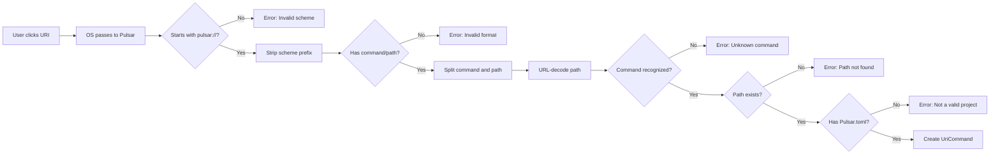
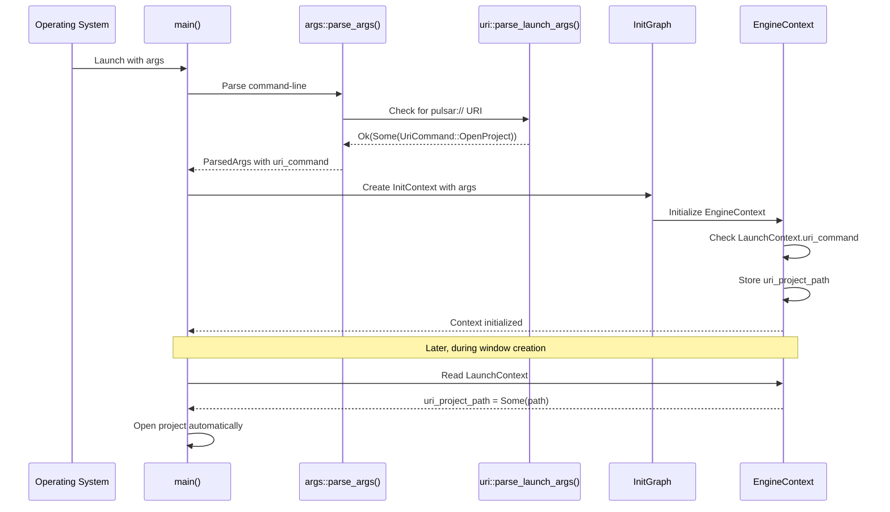

URI scheme registration enables "click to open" experiences where clicking a `pulsar://` link in a browser, document, or website automatically launches Pulsar with a specific project or file. This creates seamless integration between documentation, project management tools, and the engine itself.

## What are URI Schemes?

URI schemes are the protocol prefix in URLs—the part before `://`. You're familiar with `http://`, `https://`, `mailto:`, and `file://`. Applications can register custom URI schemes with the operating system, allowing them to handle clicks on links with that scheme.

When a user clicks `pulsar://open_project/C:\MyGame`, the OS:
1. Looks up which application handles the `pulsar://` scheme
2. Launches that application (if not already running)
3. Passes the full URI as a command-line argument
4. The application parses the URI and performs the requested action

This enables powerful workflows:

- **Documentation Integration**: Tutorial sites can link directly to example projects: "Click here to open the completed tutorial project"
- **Project Sharing**: Share a link to a project on a network drive, and colleagues just click to open it in Pulsar
- **Web-based Project Management**: Build a web interface that launches Pulsar projects with a single click
- **Discord/Slack Integration**: Share project links in team chat

> [!IMPORTANT]
> **Security Considerations**
>
> URI schemes execute local applications, which can be dangerous if not handled carefully. Pulsar validates all URI inputs:
> - Paths must exist on the filesystem
> - Projects must have a valid `Pulsar.toml` file
> - Path traversal attacks are prevented via canonicalization
> - User confirmation can be required for certain operations (future feature)

## The `pulsar://` Scheme

Pulsar registers the `pulsar://` URI scheme during its first launch. The registration is **non-destructive**—it checks if the scheme is already registered before attempting registration, and uses user-level registration that doesn't require administrator privileges.

### URI Format

All Pulsar URIs follow this format:

```
pulsar://command/url_encoded_path
```

**command**: The operation to perform (currently only `open_project`, but extensible)

**url_encoded_path**: URL-encoded filesystem path to the resource

### Example URIs

**Windows path**:
```
pulsar://open_project/C%3A%5CUsers%5Cjohn%5CDocuments%5CMyGame
```

**Unix path**:
```
pulsar://open_project/%2Fhome%2Fjohn%2Fprojects%2Fspaceshooter
```

**Network path**:
```
pulsar://open_project/%5C%5Cserver%5Cshared%5Cteam-project
```

The paths are URL-encoded to handle special characters (spaces, backslashes, Unicode) safely. The engine's parser uses the `urlencoding` crate to decode them.

> [!NOTE]
> **Why URL Encoding?**
>
> Filesystem paths can contain characters that have special meaning in URIs:
> - Spaces: `C:\My Projects\Game` → `C%3A%5CMy%20Projects%5CGame`
> - Backslashes (Windows): `\` → `%5C`
> - Unicode characters: `项目` → `%E9%A1%B9%E7%9B%AE`
>
> URL encoding ensures these paths round-trip correctly through browsers, operating systems, and the clipboard.

## Platform-Specific Registration

Each operating system handles URI scheme registration differently. Pulsar uses the `sysuri` crate to abstract over platform differences, but understanding what happens on each platform helps with debugging.

### Windows Registration

On Windows, URI schemes are registered in the Windows Registry under `HKEY_CURRENT_USER\Software\Classes`. This is a **user-level** registration—no administrator privileges required.

When Pulsar registers `pulsar://`, it creates:

```registry
[HKEY_CURRENT_USER\Software\Classes\pulsar]
@="URL:Pulsar Engine Project Protocol"
"URL Protocol"=""

[HKEY_CURRENT_USER\Software\Classes\pulsar\shell\open\command]
@="\"C:\\Path\\To\\pulsar.exe\" \"%1\""
```

When a user clicks `pulsar://open_project/C:\MyGame`, Windows:
1. Looks up the registry entry
2. Substitutes `%1` with the full URI
3. Executes: `"C:\Path\To\pulsar.exe" "pulsar://open_project/C:\MyGame"`
4. Pulsar's argument parser extracts the URI from `std::env::args()`

**Testing on Windows**:
```powershell
# Check if scheme is registered
Get-ItemProperty HKCU:\Software\Classes\pulsar

# Manually test URI handling
Start-Process "pulsar://open_project/C%3A%5CUsers%5Ctest%5Cproject"
```

### macOS Registration

On macOS, URI schemes are registered via **application bundles** (`.app` directories). The bundle's `Info.plist` file declares which URI schemes the app handles.

Pulsar creates or updates its bundle at `~/Applications/Pulsar.app` with:

```xml
<key>CFBundleURLTypes</key>
<array>
    <dict>
        <key>CFBundleURLName</key>
        <string>Pulsar Engine Project Protocol</string>
        <key>CFBundleURLSchemes</key>
        <array>
            <string>pulsar</string>
        </array>
    </dict>
</array>
```

When a user clicks a `pulsar://` link, macOS:
1. Locates the application bundle registered for `pulsar`
2. Launches the app (or activates it if already running)
3. Calls the app's `open URL` handler with the URI
4. Pulsar receives the URI via command-line args or app delegate

**Testing on macOS**:
```bash
# Check if scheme is registered
/System/Library/Frameworks/CoreServices.framework/Versions/A/Frameworks/LaunchServices.framework/Versions/A/Support/lsregister -dump | grep pulsar

# Manually test URI handling
open "pulsar://open_project/%2FUsers%2Ftest%2Fproject"
```

### Linux Registration

On Linux (freedesktop.org systems like GNOME, KDE, XFCE), URI schemes are registered via **desktop entry files** in `~/.local/share/applications/`.

Pulsar creates `~/.local/share/applications/pulsar-uri-handler.desktop`:

```desktop
[Desktop Entry]
Type=Application
Name=Pulsar Engine
Exec=/path/to/pulsar %u
MimeType=x-scheme-handler/pulsar;
NoDisplay=true
```

The `%u` placeholder is replaced with the full URI when the scheme is invoked.

After creating the desktop file, Pulsar runs:
```bash
xdg-mime default pulsar-uri-handler.desktop x-scheme-handler/pulsar
update-desktop-database ~/.local/share/applications
```

This registers the handler with the desktop environment.

**Testing on Linux**:
```bash
# Check if scheme is registered
xdg-mime query default x-scheme-handler/pulsar

# Manually test URI handling
xdg-open "pulsar://open_project/%2Fhome%2Ftest%2Fproject"
```

> [!TIP]
> **Development Builds**
>
> During development, you'll likely rebuild Pulsar frequently, changing the executable path. The URI registration points to the executable path at registration time.
>
> If you move the executable or switch between debug and release builds, re-run registration:
> ```rust
> uri::ensure_uri_scheme_registered()?;
> ```
>
> Or manually delete the registration and let Pulsar re-register on next launch.

## URI Parsing and Validation

Pulsar's URI parser (`crates/engine/src/uri/parser.rs`) performs strict validation to prevent security issues and provide clear error messages.

### Parsing Pipeline



The parser returns `Result<UriCommand>`, with detailed error messages for each failure case:

```rust
pub enum UriCommand {
    /// Open a project directly
    /// Format: pulsar://open_project/url_encoded_path
    OpenProject { path: PathBuf },

    // Future commands can be added here:
    // OpenFile { project_path: PathBuf, file_path: PathBuf },
    // CreateProject { template: String, path: PathBuf },
}
```

### Validation Rules

**Scheme Check**: Must start with `pulsar://` (case-sensitive)

**Format Check**: Must have exactly two parts: `command` and `path`

**URL Decoding**: Path must be valid URL-encoded UTF-8

**Path Existence**: For `open_project`, path must exist on filesystem

**Project Validation**: Path must contain `Pulsar.toml` file

**Command Recognition**: Command must be in the known command list

These checks ensure that malicious or malformed URIs fail gracefully with clear error messages rather than causing crashes or security issues.

> [!WARNING]
> **Path Traversal Prevention**
>
> While Pulsar validates that paths exist and contain `Pulsar.toml`, always be cautious when opening projects from untrusted sources. A malicious project could contain:
> - Build scripts that execute arbitrary code
> - Symlinks to sensitive directories
> - Large files designed to consume disk space
>
> Future versions will add user confirmation dialogs for URIs from untrusted origins.

## Integration with LaunchContext

When Pulsar starts, it parses command-line arguments to check for URI commands. The parsed command is stored in `LaunchContext` for access during initialization.



### Implementation in main.rs

The initialization code extracts the URI command early:

```rust
fn main() {
    // Parse arguments first
    let parsed = args::parse_args();

    // Create initialization context
    let mut init_ctx = InitContext::new(parsed.clone());

    // Build initialization graph...
    // ...

    // Task 7: Engine Context
    graph.add_task(InitTask::new(
        ENGINE_CONTEXT,
        "Engine Context",
        vec![CHANNELS],
        Box::new(|ctx| {
            let engine_context = EngineContext::new()
                .with_window_sender(window_tx);

            // Handle URI project path if present
            if let Some(uri::UriCommand::OpenProject { path }) = &ctx.launch_args.uri_command {
                tracing::debug!("Launching project from URI: {}", path.display());
                let mut launch = engine_context.launch.write();
                launch.uri_project_path = Some(path.clone());
            }

            ctx.engine_context = Some(engine_context);
            Ok(())
        })
    )).unwrap();

    // Execute graph...
}
```

Later, during window creation, the event loop checks for URI projects:

```rust
// In event loop startup
let ctx = EngineContext::global().unwrap();
let launch = ctx.launch.read();

if let Some(path) = &launch.uri_project_path {
    // Automatically open the project from the URI
    ctx.request_window(WindowRequest::Editor { path: path.clone() });
}
```

This provides a seamless "click to open" experience—the user clicks a link, Pulsar launches, and the project opens automatically without any manual navigation.

## Using URI Commands

### Generating URI Links

To create clickable links in documentation or web interfaces:

```rust
use urlencoding::encode;
use std::path::Path;

fn generate_project_uri(project_path: &Path) -> String {
    let path_str = project_path.to_string_lossy();
    let encoded = encode(&path_str);
    format!("pulsar://open_project/{}", encoded)
}

// Example
let uri = generate_project_uri(Path::new("C:\\Users\\john\\MyGame"));
// Returns: "pulsar://open_project/C%3A%5CUsers%5Cjohn%5CMyGame"
```

### HTML Links

In HTML documentation or web pages:

```html
<a href="pulsar://open_project/C%3A%5CUsers%5Cjohn%5CMyGame">
    Open MyGame Project
</a>
```

When the user clicks the link, their browser asks "Open in Pulsar Engine?" and launches the application.

### Markdown Documentation

In Markdown files (like README.md):

```markdown
[Open Example Project](pulsar://open_project/%2Fhome%2Fjohn%2Fexamples%2Fplatformer)
```

GitHub, GitLab, and most Markdown renderers create clickable links that trigger the URI handler.

### Discord/Slack Integration

In Discord or Slack messages, paste the URI directly:

```
Check out my project: pulsar://open_project/C%3A%5CUsers%5Cjohn%5CMyGame
```

The chat client automatically linkifies it, and clicking opens Pulsar.

## Debugging URI Handling

### Enable Verbose Logging

Launch Pulsar with verbose logging to see URI parsing:

```bash
pulsar.exe -v
```

You'll see logs like:
```
[DEBUG] Checking URI scheme registration...
[DEBUG] ✅ pulsar:// URI scheme already registered
[DEBUG] Parsing command-line arguments...
[DEBUG] Found URI: pulsar://open_project/C%3A%5CUsers%5Ctest%5Cproject
[DEBUG] Launching project from URI: C:\Users\test\project
```

### Test URI Parsing Manually

Use the parser directly in a test or debug build:

```rust
use pulsar::uri::parse_uri;

fn main() {
    let uri = "pulsar://open_project/C%3A%5CUsers%5Ctest%5Cproject";

    match parse_uri(uri) {
        Ok(cmd) => println!("Parsed: {:?}", cmd),
        Err(e) => eprintln!("Error: {}", e),
    }
}
```

### Common Issues

**"URI scheme not registered"**
- Solution: Run `uri::ensure_uri_scheme_registered()` or let Pulsar start once to auto-register

**"Path does not exist"**
- The URL-encoded path is wrong or the project was moved
- Decode the path manually to verify: use an online URL decoder or the `urlencoding` crate

**"Not a valid Pulsar project (missing Pulsar.toml)"**
- The path exists but isn't a Pulsar project
- Ensure `Pulsar.toml` is in the root of the project directory

**"Invalid URI format"**
- Missing slash between command and path
- Correct: `pulsar://open_project/path`
- Wrong: `pulsar://open_projectpath`

**Windows: "Application not found for URI"**
- Check registry: `Get-ItemProperty HKCU:\Software\Classes\pulsar`
- Re-register by launching Pulsar once

**macOS: "No application to open the URL"**
- Check registration: `lsregister -dump | grep pulsar`
- Rebuild application bundle or re-run registration

**Linux: "No handler for x-scheme-handler/pulsar"**
- Check: `xdg-mime query default x-scheme-handler/pulsar`
- Re-run: `xdg-mime default pulsar-uri-handler.desktop x-scheme-handler/pulsar`

## Future Extensions

The URI command system is designed to be extensible. Future commands might include:

**Open Specific File**:
```
pulsar://open_file/project_path/src/main.rs
```
Opens the project and navigates to `src/main.rs` in the code editor.

**Create from Template**:
```
pulsar://create_project/platformer/C%3A%5CUsers%5Cjohn%5CNewGame
```
Creates a new project from the "platformer" template at the specified path.

**Join Multiplayer Session**:
```
pulsar://join_session/session_id_12345
```
Connects to a collaborative editing session or multiplayer game server.

**Install Plugin**:
```
pulsar://install_plugin/https%3A%2F%2Fgithub.com%2Fuser%2Fplugin
```
Downloads and installs a plugin from a Git repository.

Adding new commands is straightforward:

1. Add variant to `UriCommand` enum (`crates/engine/src/uri/commands.rs`)
2. Add parsing logic to `parse_uri()` (`crates/engine/src/uri/parser.rs`)
3. Handle the command in initialization or event loop

The registration and platform integration remain the same—only the command parsing changes.

## Security Best Practices

When implementing new URI commands, follow these security guidelines:

**Always validate inputs**: Check paths exist, are within expected directories, and don't contain path traversal (`../`) attacks

**User confirmation for destructive actions**: Commands that delete files, modify projects, or access the network should prompt the user

**Sandbox untrusted projects**: Projects from untrusted sources should run with limited permissions (future feature)

**Rate limiting**: Prevent URI spam by rate-limiting opens (e.g., max 1 project open per 5 seconds)

**Audit logging**: Log all URI invocations for security auditing

## Related Documentation

- [Engine State Management](./engine-state) - How LaunchContext integrates with EngineContext
- [Architecture](./architecture) - Initialization sequence and URI registration phase
- [Command-Line Interface](./cli) - Other command-line options besides URI handling (coming soon)
