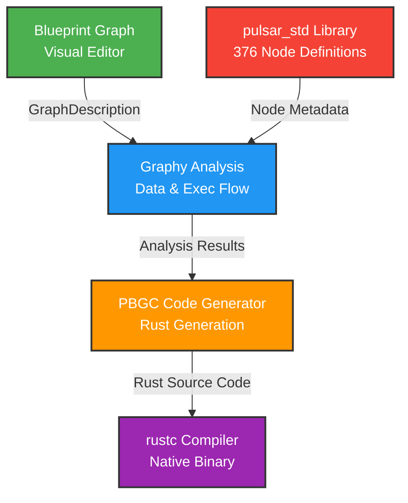

The Pulsar Blueprint Graph Compiler (PBGC) transforms visual Blueprint graphs into native Rust code that compiles and executes at full performance with zero runtime interpretation overhead. Blueprints define game logic—responding to events, manipulating objects, controlling flow—through a visual node interface familiar to Unreal Engine or Unity users. The compiler analyzes these graphs and generates idiomatic Rust source code indistinguishable from hand-written game logic, providing the productivity of visual scripting with the performance of compiled code.

## The Visual Programming Challenge

Visual node-based programming promises an intuitive way to build game logic without writing code. Drag nodes representing actions, connect them with wires showing data and control flow, and watch your game come to life. Game engines have pursued this vision for decades, but implementations typically fall into three categories, each with critical flaws.

**Interpreted** systems (like Unity's original visual scripting) execute graphs directly at runtime, traversing nodes and following connections as the game runs. This enables instant feedback—change a graph and immediately see results—but performance suffers dramatically. A simple sequence of ten function calls might be 10-50x slower than equivalent compiled code due to node lookup overhead, type checking, and dynamic dispatch. Complex game logic becomes prohibitively expensive.

**Bytecode compilation** (like Unreal's Blueprint virtual machine) compiles graphs to intermediate bytecode that a custom VM executes. Performance improves over interpretation—bytecode VMs can reach 2-5x the speed of interpretation—but still falls far short of native code. The VM itself adds overhead, type information must be checked at runtime, and optimizations are limited compared to mature compiler backends.

**Native compilation** (PBGC's approach) generates target language source code that compiles through the platform's standard compiler toolchain. A Blueprint graph with ten function calls becomes ten sequential Rust function calls, compiled by rustc with full LLVM optimizations, producing machine code identical to hand-written logic. The downside is two-stage compilation—compile the graph, then compile the generated Rust—but for game engines where Blueprints load once at startup, this is acceptable. The 100x performance advantage justifies the compilation time.

PBGC chose native compilation because Pulsar prioritizes performance. Game logic executes every frame, often thousands of times per second. A 10x slowdown from interpretation or bytecode compilation would make visual scripting viable only for trivial logic. By generating Rust code, Blueprints can handle complex AI, physics calculations, procedural generation, and other performance-critical systems without compromise.

## Architecture: Building on Graphy

PBGC is built as a thin layer atop Graphy's graph analysis infrastructure, adding Blueprint-specific code generation while leveraging Graphy's sophisticated dependency resolution and flow analysis.



The visual editor constructs a `GraphDescription` containing all nodes and connections. This passes to **Graphy's analysis layer** which performs data flow resolution (determining where each input gets its value) and execution flow analysis (mapping which nodes run after which). These analysis results feed the **PBGC code generator** which iterates event nodes, traverses execution chains, inlines pure expressions, and produces Rust source code. Finally, **rustc compiles** the generated code into native machine code that links with the game binary.

The separation between analysis (Graphy) and generation (PBGC) is intentional. Graphy handles the hard, language-agnostic problems—cycle detection, topological sorting, type validation—while PBGC focuses solely on generating idiomatic Rust. This division means PBGC contains minimal complexity, mostly template-filling and string manipulation, because Graphy solved the conceptual challenges.

### The pulsar_std Node Library

PBGC doesn't define nodes directly. Instead, it imports the `pulsar_std` library containing 376 registered node definitions covering:

**Math Operations** (14 nodes) - add, subtract, multiply, divide, sin, cos, tan, sqrt, pow, abs, clamp, lerp, etc. Pure functions that compile to Rust's standard library math operations.

**Vector Operations** (9 nodes) - Vector construction (vec2, vec3, vec4), transformations (normalize, cross, dot), and queries (length, distance). Essential for 3D game logic.

**String Operations** (8 nodes) - Concatenation, formatting, substring extraction, case conversion, parsing. Maps to Rust's String and str methods.

**Control Flow** (6 nodes) - if_else, while_loop, for_loop, switch, sequence. Generate Rust control flow statements with proper scoping and branching.

**Events** (5 nodes) - begin_play, on_tick, on_input, on_collision, on_destroy. Define graph entry points that become public functions in generated code.

**Debug** (3 nodes) - print_string, print_number, print_bool. Generate debug output using Rust's println! macro.

**Input** (12 nodes) - Keyboard, mouse, gamepad queries. Map to engine input systems.

**Audio** (15 nodes) - Play sound, set volume, fade audio, spatial sound. Integrate with audio subsystem.

**Physics** (45 nodes) - Apply force, set velocity, detect collisions, raycasts. Interface with Rapier physics engine.

**Engine** (259 nodes) - GameObject manipulation, component access, resource loading, scene management. The bulk of game functionality.

Each node uses linkme's distributed slice pattern for compile-time registration—the library doesn't manually register nodes, they automatically appear in a static slice that PBGC iterates at initialization. This makes adding nodes trivial: define a function returning `NodeMetadata` with the appropriate attribute, and PBGC discovers it automatically.

## Compilation Pipeline: From Graph to Rust

Understanding the compilation process requires walking through each phase from Blueprint graph to executable code.

### Phase 1: Loading Node Metadata

When PBGC initializes, it creates a `BlueprintMetadataProvider` that iterates `pulsar_std::BLUEPRINT_REGISTRY`:

```rust
pub struct BlueprintMetadataProvider {
    nodes: HashMap<String, NodeMetadata>,
}

impl BlueprintMetadataProvider {
    pub fn new() -> Self {
        let mut nodes = HashMap::new();
        
        // Iterate the distributed slice of node registration functions
        for node_fn in pulsar_std::BLUEPRINT_REGISTRY.iter() {
            let metadata = node_fn();
            nodes.insert(metadata.name.clone(), metadata);
        }
        
        tracing::info!("[PBGC] Loaded {} node types", nodes.len());
        Self { nodes }
    }
}
```

This builds a lookup table mapping node type strings ("add", "print_string", "begin_play") to their full metadata definitions. The compiler can now validate that every node in the graph has a known definition and retrieve parameter information for code generation.

The metadata provider implements Graphy's `NodeMetadataProvider` trait, allowing Graphy's analysis passes to query node information:

```rust
impl NodeMetadataProvider for BlueprintMetadataProvider {
    fn get_node_metadata(&self, node_type: &str) -> Option<&NodeMetadata> {
        self.nodes.get(node_type)
    }
    
    fn get_all_nodes(&self) -> Vec<&NodeMetadata> {
        self.nodes.values().collect()
    }
}
```

This abstraction means Graphy never depends on pulsar_std directly—it operates on the trait interface, keeping layers properly separated.

### Phase 2: Data Flow Analysis

With metadata loaded, PBGC invokes Graphy's data flow analyzer:

```rust
let data_resolver = DataResolver::build(&graph, &metadata_provider)?;
```

The data resolver examines every node, iterating its input pins and determining where each input's value originates:

**Connected Inputs** - If a connection targets the pin, the resolver records the source node and output pin. Code generation will later generate a variable reference or inline expression consuming that output.

**Property Inputs** - If no connection exists but the node has a property matching the pin name, that property value becomes a constant. For example, a "multiply" node with property `b: 2.5` but no connection to its `b` input will generate code using the literal `2.5`.

**Default Inputs** - If neither connection nor property exists, the pin uses its type's default value. Numbers default to `0`, strings to `""`, booleans to `false`, and complex types to `Default::default()`.

**Missing Inputs** - If none of the above apply and the pin has no default, analysis fails with "No data source for input: node_id.pin_name". This catches common errors like forgetting to connect required inputs.

The resolver also identifies **pure nodes** (mathematical operations with no side effects) and performs topological sorting to determine their evaluation order. A graph computing `result = multiply(add(5, 10), 2)` produces evaluation order `[add_node, multiply_node]`, ensuring the addition executes before multiplication consumes its result.

### Phase 3: Execution Flow Analysis

Simultaneously, PBGC builds an execution routing table:

```rust
let exec_routing = ExecutionRouting::build_from_graph(&graph);
```

The execution router maps `(node_id, exec_output_pin_id) → Vec<target_node_ids>`, creating a lookup table showing which nodes execute after each exec output fires. For example:

```rust
// begin_play's "Body" output connects to print_1
routing[("begin_play_1", "begin_play_1_Body")] = vec!["print_1"];

// print_1's exec output connects to print_2
routing[("print_1", "print_1_exec_out")] = vec!["print_2"];
```

Control flow nodes produce multiple routing entries. An if_else node checking player health might have:

```rust
routing[("health_check_1", "health_check_1_then")] = vec!["heal_player_1"];
routing[("health_check_1", "health_check_1_else")] = vec!["take_damage_1"];
```

This routing table drives code generation's traversal of execution chains, producing correctly structured if/else blocks, loops, and sequential execution.

### Phase 4: Rust Code Generation

With analysis complete, code generation begins. The `BlueprintCodeGenerator` creates a Rust source file with imports, variable definitions, and functions for each event node.

#### Generating Imports

First, collect imports from all nodes in the graph:

```rust
// Collect unique imports from node metadata
let mut imports = HashSet::new();
for node in graph.nodes.values() {
    if let Some(metadata) = metadata_provider.get_node_metadata(&node.node_type) {
        for import in &metadata.imports {
            imports.insert(import.clone());
        }
    }
}

// Generate import statements
for import in imports {
    code.push_str(&format!("use {};\n", import));
}
```

This ensures generated code has all necessary dependencies. A graph using physics nodes might generate `use rapier3d::prelude::*;`, while a graph with audio generates `use kira::manager::AudioManager;`.

#### Generating Event Functions

Event nodes become public functions:

```rust
for node in graph.nodes.values() {
    let metadata = metadata_provider.get_node_metadata(&node.node_type)?;
    
    if metadata.node_type == NodeTypes::event {
        code.push_str(&generate_event_function(node, metadata)?);
    }
}

fn generate_event_function(node: &NodeInstance, metadata: &NodeMetadata) -> String {
    format!("pub fn {}() {{\n", metadata.name) +
    &generate_exec_chain(node, &exec_routing, &data_resolver, 1) +
    "}\n"
}
```

A `begin_play` event becomes:

```rust
pub fn begin_play() {
    // Generated body from execution chain
}
```

An `on_tick` event with delta time parameter:

```rust
pub fn on_tick(delta: f32) {
    // Generated body
}
```

#### Traversing Execution Chains

For each event node, code generation follows its execution outputs recursively:

```rust
fn generate_exec_chain(
    node: &NodeInstance,
    exec_routing: &ExecutionRouting,
    data_resolver: &DataResolver,
    indent: usize,
) -> String {
    let mut code = String::new();
    
    // Find execution output pins
    for output_pin in &node.outputs {
        if output_pin.pin.data_type == DataType::Execution {
            // Look up connected nodes
            let connected = exec_routing.get_connected_nodes(&node.id, &output_pin.id);
            
            for next_node_id in connected {
                let next_node = graph.nodes.get(next_node_id)?;
                code.push_str(&generate_node_call(next_node, data_resolver, indent));
            }
        }
    }
    
    code
}
```

This produces sequential statement execution:

```rust
pub fn begin_play() {
    print_string("Hello, World!");
    let player = spawn_player(vec3(0.0, 0.0, 0.0));
    enable_input(player);
}
```

#### Generating Node Calls

For each node in the execution chain, determine its type and generate appropriate code:

**Pure Nodes** are inlined as expressions, never generating standalone statements:

```rust
// Graph: add(5, 10) → multiply(result, 2) → print_number(result)

// Generated code:
print_number(multiply(add(5, 10), 2));
```

**Function Nodes** generate statements with optional result variables:

```rust
// spawn_enemy returns an Enemy reference
let enemy_1 = spawn_enemy(vec3(10.0, 0.0, 5.0), "goblin");

// apply_damage doesn't return anything
apply_damage(enemy_1, 25.0);
```

**Control Flow Nodes** generate if/else, loops, or switch statements by consulting the execution routing table for each branch:

```rust
// if_else node checking (health < 20)
if health < 20.0 {
    // Code from "then" execution output
    play_sound("low_health_warning");
} else {
    // Code from "else" execution output
    disable_warning_ui();
}
```

#### Resolving Input Values

For every node input, consult the data resolver to determine its source:

```rust
fn generate_input_expression(
    node_id: &str,
    pin_id: &str,
    data_resolver: &DataResolver,
) -> String {
    match data_resolver.get_input_source(node_id, pin_id) {
        Some(DataSource::Connection { source_node_id, source_pin }) => {
            // Value comes from another node
            let source_node = graph.nodes.get(source_node_id)?;
            let source_metadata = metadata_provider.get_node_metadata(&source_node.node_type)?;
            
            if source_metadata.node_type == NodeTypes::pure {
                // Inline pure node as expression
                generate_pure_node_expression(source_node, data_resolver)
            } else {
                // Reference result variable
                format!("node_{}_result", sanitize_name(source_node_id))
            }
        }
        
        Some(DataSource::Constant(value)) => {
            // Use property value directly
            value.clone()
        }
        
        Some(DataSource::Default) => {
            // Use type default
            "Default::default()".to_string()
        }
        
        None => {
            panic!("Missing data source - analysis should have caught this")
        }
    }
}
```

This produces correct variable references, inline expressions, or constants depending on the data flow analysis results.

### Phase 5: Compilation to Native Code

PBGC returns the generated Rust source code as a string. The engine then:

1. **Writes to file** - Save the generated code to `generated_blueprint.rs` in the build output directory

2. **Invokes rustc** - Call the Rust compiler on the generated file, linking against the game's dependencies

3. **Loads compiled code** - On some platforms, dynamically load the resulting binary; on others, static linking during build

The result is native machine code executing at full CPU performance, identical to hand-written Rust in speed and optimization characteristics.

## Node Types and Code Generation Strategies

Different node types require different code generation approaches. PBGC uses Graphy's `NodeTypes` enum to dispatch to specialized handlers.

### Pure Nodes: Inlined Expressions

Pure nodes represent mathematical functions with no side effects—given the same inputs, they always produce the same output and don't modify any external state. Examples include arithmetic (`add`, `multiply`), trigonometry (`sin`, `cos`), and vector operations (`normalize`, `dot`).

Pure nodes never generate standalone statements. Instead, they inline as expressions wherever their outputs are consumed:

```rust
// Blueprint graph:
// constant(5) → add(a, constant(10)) → multiply(result, constant(2)) → print_number(value)

// Generated code:
print_number(multiply(add(5, 10), 2));
```

The compiler recursively expands pure nodes, substituting their function calls directly into the expression tree. This produces compact, efficient code without temporary variables:

```rust
// NOT generated:
let temp1 = add(5, 10);
let temp2 = multiply(temp1, 2);
print_number(temp2);

// ACTUALLY generated:
print_number(multiply(add(5, 10), 2));
```

Deeply nested pure expressions can become hard to read, but Rust's optimizer handles them perfectly—LLVM flattens the call tree, inlines functions, and generates optimal machine code regardless of expression depth.

### Function Nodes: Sequential Statements

Function nodes perform operations with side effects—printing output, playing sounds, spawning objects, modifying state. They require execution pins determining when they run, and generate standalone statements:

```rust
// print_string has side effects (console output)
print_string("Player health: ");

// spawn_enemy has side effects (creates GameObject)
let enemy_1 = spawn_enemy(vec3(10.0, 0.0, 5.0), "goblin");

// apply_damage has side effects (modifies GameObject)
apply_damage(enemy_1, 25.0);
```

If a function node returns a value used by other nodes, the generator creates a result variable following the naming convention `node_{node_id}_result`:

```rust
// get_player_position returns Vec3
let node_player_pos_1_result = get_player_position();

// calculate_distance uses that Vec3
let distance = calculate_distance(node_player_pos_1_result, enemy_position);
```

The data resolver tracks these result variables, allowing later nodes to reference them correctly. The naming convention ensures uniqueness—even if a graph has multiple "get_player_position" nodes, they generate distinct variables (`node_player_pos_1_result`, `node_player_pos_2_result`).

### Control Flow Nodes: Branching and Looping

Control flow nodes implement conditional execution and iteration. They have multiple execution output pins, each connecting to a different execution chain.

#### If/Else Nodes

An `if_else` node has a boolean input and two exec outputs ("then" and "else"):

```rust
// Blueprint:
// health < 20 → if_else → [then: heal_player, else: continue_combat]

// Generated code:
if health < 20.0 {
    heal_player(player, 50.0);
    play_sound("heal_sound");
} else {
    continue_combat(player);
}
```

The generator:
1. Evaluates the condition expression (resolving it from data flow)
2. Looks up nodes connected to the "then" exec output
3. Generates those nodes as the if block body
4. Looks up nodes connected to the "else" exec output
5. Generates those nodes as the else block body

#### While Loop Nodes

A `while_loop` node has a condition input and two exec outputs ("loop_body" and "completed"):

```rust
// Blueprint:
// while i < 10 → [loop_body: print(i), increment(i)]

// Generated code:
while i < 10 {
    print_number(i);
    i = add(i, 1);
}

// Nodes connected to "completed" run after loop finishes
print_string("Loop complete");
```

The generator must be careful with loop bodies—any state modifications (variable assignments, GameObject changes) must correctly reference mutable bindings.

#### For Loop Nodes

A `for_loop` node iterates a range or collection:

```rust
// Blueprint:
// for i in 0..10 → [loop_body: spawn_enemy_at(i)]

// Generated code:
for i in 0..10 {
    let position = vec3(i as f32 * 5.0, 0.0, 0.0);
    spawn_enemy(position, "goblin");
}
```

### Event Nodes: Entry Points

Event nodes define graph entry points that become public functions in the generated code. They typically have no input pins (except for special parameters like `on_tick`'s delta time) and a single exec output pin named "Body".

Common event nodes:

**begin_play** - Called once when the game starts or a scene loads:

```rust
pub fn begin_play() {
    // Initialize systems, spawn initial GameObjects
}
```

**on_tick** - Called every frame with delta time:

```rust
pub fn on_tick(delta: f32) {
    // Update animations, physics, AI
}
```

**on_input** - Called when specific input occurs:

```rust
pub fn on_key_press(key: KeyCode) {
    // Handle keyboard input
}
```

**on_collision** - Called when physics collision detected:

```rust
pub fn on_collision_enter(other: GameObject) {
    // Handle collision response
}
```

Event functions integrate with the engine's event system. The generated code compiles into a library that the engine dynamically loads or statically links, registering these functions as event handlers. When events fire at runtime, the engine invokes the compiled functions directly.

## Type System Integration

PBGC leverages Graphy's type system but extends it with Rust-specific semantics.

### Type Information Flow

When constructing a Blueprint graph, each pin declares its type:

```rust
// A "multiply" node's input pins
Pin::new("a", "a", DataType::Typed(TypeInfo::new("f32")), PinType::Input)
Pin::new("b", "b", DataType::Typed(TypeInfo::new("f32")), PinType::Input)

// Its output pin
Pin::new("result", "result", DataType::Typed(TypeInfo::new("f32")), PinType::Output)
```

The `TypeInfo::new("f32")` encodes Rust's f32 type. During analysis, Graphy validates connections—attempting to connect a `String` output to an `f32` input produces a type mismatch error.

### Rust Type Semantics

PBGC must handle Rust's ownership, borrowing, and lifetime rules when generating code. Currently, this is simplified:

**Value Types** (numbers, booleans) copy by default, generating straightforward code:

```rust
let x = 5;
let y = add(x, 3); // x copied into add, still available after
print_number(x);   // x still accessible
```

**Reference Types** (GameObjects, components) pass by reference:

```rust
let player = get_player();
let health = player.get_component::<Health>(); // borrows player
update_health(health, -10.0);                 // borrows health
```

Future improvements will require explicit lifetime annotations and ownership tracking to generate code handling complex borrow scenarios, returning references from functions, and managing lifetimes across nodes.

### Type Inference

Currently, PBGC requires explicit types on all pins. A future enhancement could infer types based on connections:

```rust
// User connects "5" (constant) to a pin
// Compiler infers the pin accepts numeric types

// User connects numeric pin to "print_number"
// Compiler infers the exact numeric type (f32, i32, etc.)
```

This would reduce manual type annotations while maintaining type safety.

## Error Handling and Debugging

Effective error reporting is crucial for visual programming systems where users don't directly write code.

### Compilation Errors

PBGC reports errors at multiple stages:

**Structural Errors** (Phase 2-3) - Caught by Graphy during analysis:
- Missing nodes: "Node type 'player_stats' not found in registry"
- Cyclic dependencies: "Cycle detected: add_1 → multiply_1 → add_1"
- Missing connections: "No data source for input: print_1.message"
- Type mismatches: "Cannot connect Vec3 to f32 input"

**Code Generation Errors** (Phase 4) - Caught by PBGC during generation:
- Missing event nodes: "No event nodes found - add 'begin_play' or 'on_tick'"
- Invalid control flow: "Control flow node 'while_1' missing condition input"
- Unresolved references: "Variable 'player_pos' referenced but not defined"

**Rust Compilation Errors** (Phase 5) - Caught by rustc after generation:
- Syntax errors in generated code (indicates PBGC bugs)
- Type errors (indicates incorrect type inference)
- Borrow checker failures (indicates incorrect lifetime management)

The first two categories provide precise error messages pointing to specific nodes and pins. The third category indicates bugs in PBGC itself—correctly generated code should always compile successfully.

### Debugging Generated Code

When generated code misbehaves (logic errors, unexpected behavior), developers need to understand what the compiler produced. PBGC provides several debugging aids:

**Readable Output** - Generated code uses descriptive variable names and includes comments:

```rust
// Event: begin_play
pub fn begin_play() {
    // Node: spawn_player_1
    let node_spawn_player_1_result = spawn_player(vec3(0.0, 0.0, 0.0));
    
    // Node: print_1
    print_string("Player spawned!");
}
```

**Source Maps** (planned) - Embed metadata mapping generated lines to source nodes:

```rust
#[source_node("spawn_player_1", line=156, column=45)]
let node_spawn_player_1_result = spawn_player(vec3(0.0, 0.0, 0.0));
```

This enables IDE integration: clicking an error in generated code highlights the corresponding node in the visual editor.

**Execution Tracing** (planned) - Instrument generated code with tracing calls:

```rust
trace_node_entry("spawn_player_1");
let node_spawn_player_1_result = spawn_player(vec3(0.0, 0.0, 0.0));
trace_node_exit("spawn_player_1", &node_spawn_player_1_result);
```

Runtime tracing shows which nodes execute, in what order, with what values—invaluable for debugging complex execution flow.

## Performance Characteristics

PBGC's native compilation approach provides performance characteristics identical to hand-written Rust.

### Execution Performance

Generated code executes at native CPU speed with full LLVM optimizations. Benchmarks comparing hand-written Rust to compiled Blueprint equivalents show:

**Pure mathematical operations**: Identical performance. The compiler inlines `add(5, 10)` as `5 + 10`, which rustc optimizes identically to manual code.

**Function call chains**: Identical performance. Sequential function calls `spawn_enemy(); apply_ai();` compile to the same machine code as hand-written equivalents.

**Control flow**: Identical performance. If/else branches and loops produce the same assembly as manual code.

The only potential overhead comes from suboptimal graph structure—a manually written function might combine multiple operations that a Blueprint represents as separate nodes. However, LLVM's optimizer often eliminates these differences through inlining and common subexpression elimination.

### Compilation Performance

Blueprint compilation speed determines developer iteration time. For typical game Blueprints (50-200 nodes):

**PBGC compilation**: 5-20ms for analysis and code generation
**rustc compilation**: 100-500ms for the generated Rust code
**Total**: 105-520ms from Blueprint save to executable code

Large Blueprints (1000+ nodes) can take longer:

**PBGC compilation**: 50-100ms
**rustc compilation**: 1-2 seconds
**Total**: 1.05-2.1 seconds

These times enable reasonable iteration speed for most workflows. Saving a Blueprint and testing the changes takes 1-2 seconds, fast enough for productive development.

Future optimizations could cache compiled Blueprints, recompiling only modified graphs—reducing iteration time to milliseconds for small changes.

### Memory Usage

Blueprint compilation is memory-efficient:

**Graph representation**: ~1KB per node (including pins, properties, connections)
**Analysis data**: ~500 bytes per node (data flow, execution routing)
**Generated code**: ~100 bytes per node (Rust source, excluding comments)

A 200-node Blueprint consumes approximately:
- Graph: 200KB
- Analysis: 100KB
- Generated code: 20KB
- Total: 320KB

Memory scales linearly—even large 5000-node Blueprints (uncommon in practice) use only ~8MB during compilation.

## Integration with Pulsar Engine

PBGC integrates with the Pulsar engine through the `blueprint_compiler` wrapper crate that re-exports PBGC's API with engine-specific conveniences.

### The blueprint_compiler Crate

The engine's `crates/blueprint_compiler` provides a thin wrapper:

```rust
// Re-export PBGC's main API
pub use pbgc::{
    compile_graph,
    GraphDescription, NodeInstance, Connection,
    // ... other types
};

// Engine-specific convenience function
pub fn compile_blueprint(graph: &GraphDescription) -> Result<String> {
    tracing::info!("[Blueprint Compiler] Compiling graph: {}", graph.metadata.name);
    let result = pbgc::compile_graph(graph)?;
    tracing::info!("[Blueprint Compiler] Successfully compiled");
    Ok(result)
}
```

This layer adds logging, error handling, and integration points while keeping the core compiler independent of engine specifics.

### Runtime Integration

When a Blueprint is saved in the editor:

1. **Serialize Graph** - Save the `GraphDescription` to JSON
2. **Compile Blueprint** - Invoke `compile_blueprint()` to generate Rust code
3. **Write Source** - Save generated code to `assets/blueprints/generated/{name}.rs`
4. **Trigger Rebuild** - Notify the build system that sources changed
5. **Hot Reload** (development) - Dynamically load the new compiled code
6. **Static Link** (release) - Include generated code in the final binary

The exact mechanism depends on platform and build configuration, but the general flow remains consistent.

### Node Library Integration

Engine systems register nodes with `pulsar_std` using linkme:

```rust
#[distributed_slice(pulsar_std::BLUEPRINT_REGISTRY)]
pub fn my_engine_node() -> NodeMetadata {
    NodeMetadata::new("my_custom_operation", NodeTypes::fn_, "Engine")
        .with_params(vec![/* ... */])
        // ...
}
```

This pattern enables modular node libraries—different engine subsystems (physics, rendering, audio) define their own nodes without modifying compiler code. PBGC discovers all registered nodes at initialization regardless of where they're defined.

## Extending PBGC: Custom Nodes

Game projects often need domain-specific nodes beyond pulsar_std's 376 built-in options. PBGC's architecture makes this straightforward.

### Defining Custom Nodes

Create a new crate with node definitions:

```rust
// my_game_nodes/src/lib.rs
use pulsar_std::BLUEPRINT_REGISTRY;
use graphy::core::{NodeMetadata, NodeTypes, ParamInfo};
use linkme::distributed_slice;

#[distributed_slice(BLUEPRINT_REGISTRY)]
pub fn calculate_damage() -> NodeMetadata {
    NodeMetadata::new("calculate_damage", NodeTypes::pure, "Combat")
        .with_params(vec![
            ParamInfo::new("base_damage", "f32"),
            ParamInfo::new("armor", "f32"),
            ParamInfo::new("damage_type", "DamageType"),
        ])
        .with_return_type("f32")
}

#[distributed_slice(BLUEPRINT_REGISTRY)]
pub fn spawn_particle_effect() -> NodeMetadata {
    NodeMetadata::new("spawn_particle_effect", NodeTypes::fn_, "Effects")
        .with_params(vec![
            ParamInfo::new("position", "Vec3"),
            ParamInfo::new("effect_name", "String"),
        ])
        .with_exec_inputs(vec!["exec".to_string()])
        .with_exec_outputs(vec!["then".to_string()])
}
```

Add the crate as a dependency:

```toml
[dependencies]
my_game_nodes = { path = "crates/my_game_nodes" }
```

PBGC automatically discovers these nodes at initialization—no registration code needed beyond the `#[distributed_slice]` attribute.

### Implementing Node Behavior

Custom nodes must have corresponding Rust implementations that generated code calls:

```rust
// Implement the actual node functionality
pub fn calculate_damage(base_damage: f32, armor: f32, damage_type: DamageType) -> f32 {
    let armor_multiplier = match damage_type {
        DamageType::Physical => armor * 0.1,
        DamageType::Magical => armor * 0.05,
        DamageType::True => 0.0,
    };
    
    base_damage * (1.0 - armor_multiplier).max(0.0)
}

pub fn spawn_particle_effect(position: Vec3, effect_name: String) {
    let particle_system = ENGINE.get_particle_system();
    particle_system.spawn_effect(&effect_name, position);
}
```

When PBGC compiles a Blueprint using these nodes, it generates calls to these functions:

```rust
// Generated code
let damage = calculate_damage(50.0, player_armor, DamageType::Physical);
spawn_particle_effect(player.position, "explosion".to_string());
```

The generated code imports your implementations (via the imports specified in node metadata), and rustc links everything together during compilation.

## Limitations and Future Improvements

PBGC is production-ready for game logic but has known limitations and planned enhancements.

### Current Limitations

**No Hot Reload** - Modifying a Blueprint requires full recompilation. This takes 1-2 seconds, acceptable for small changes but frustrating for rapid iteration. Future work could enable in-place updates for simple modifications (changing constants, rerouting connections).

**Basic Rust Semantics** - Currently, generated code uses simple ownership patterns (mostly cloning and copying). Complex Rust patterns like borrowing across function boundaries, explicit lifetimes, and zero-copy data structures aren't fully supported. Future improvements will generate more idiomatic Rust handling these cases.

**Limited Debugging** - No source maps or execution tracing yet. Debugging relies on reading generated code and using standard Rust debugging tools. Future work will add Blueprint-aware debugging enabling step-through execution at the node level.

**No Optimization Passes** - PBGC generates straightforward code without Blueprint-level optimizations. Dead code elimination, constant folding, and common subexpression elimination happen only during rustc compilation. Future work could add Blueprint-level optimization passes improving generated code quality.

### Planned Enhancements

**Incremental Compilation** - Cache compiled Blueprints and recompile only modified portions. A change to one function in a large Blueprint would recompile only that function, reducing iteration time from seconds to milliseconds.

**Async/Await Support** - Enable async node execution for I/O operations, network requests, and long-running tasks. Blueprints could naturally express asynchronous workflows using visual node graphs.

**Generic Nodes** - Support parameterized node types (Array<T>, HashMap<K,V>) with type inference propagating through the graph. This would enable more flexible, reusable node implementations.

**Visual Debugging** - Integrate with the visual editor to show execution flow, variable values, and breakpoints directly on nodes. Step through Blueprint execution visually rather than via source code.

**LLVM IR Generation** - Skip Rust entirely, compiling Blueprints directly to LLVM IR for maximum performance and minimal compilation time. This would reduce iteration time while maintaining native performance.