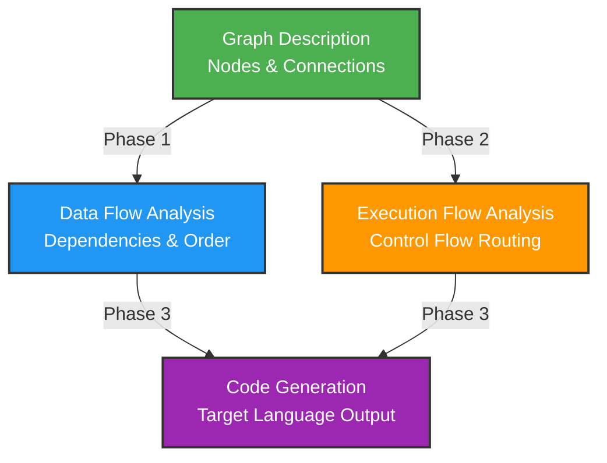

Graphy is the foundational graph compilation library that transforms visual node graphs into executable code. It provides the analysis infrastructure used by both the Blueprint Compiler (generating Rust game logic) and the Shader Compiler (generating WGSL shaders). The library handles all the complex work of dependency resolution, execution flow analysis, and optimization—allowing domain-specific compilers to focus solely on code generation for their target language.

## The Problem: Why Visual Programming Needs Sophisticated Compilation

Visual node-based programming appears simple on the surface: boxes connected by lines representing data and control flow. Users expect these graphs to "just work" like hand-written code. However, the translation from visual representation to executable code involves subtle complexities that naive approaches fail to handle correctly.

Consider a simple Blueprint graph with three nodes: "Get Player Position" → "Calculate Distance" → "Print Distance". The visual representation shows a clear linear flow, but the compiled code must handle numerous edge cases. What if "Calculate Distance" needs two inputs but only one is connected? Should it use a default value, throw an error, or wait for both inputs? What if the graph contains a cycle where Node A depends on Node B which depends on A? Should the compiler detect this and report it, or silently produce incorrect code?

Graphy solves these problems through **multi-phase analysis**. Rather than directly generating code from the graph structure, Graphy first builds a complete understanding of data dependencies and execution flow. It performs topological sorting to determine evaluation order, detects cycles that would cause infinite loops, tracks type information to validate connections, and optimizes pure functional nodes by inlining them as expressions rather than generating temporary variables. Only after this thorough analysis does code generation begin, producing correct, efficient code that handles all edge cases properly.

## Core Architecture

Graphy consists of three distinct layers, each with clearly defined responsibilities:



The **Graph Description** layer defines the data structures representing visual graphs—nodes with typed input/output pins, connections between those pins, property values embedded in nodes, and metadata about the graph itself. This layer is purely structural, containing no analysis or compilation logic. You construct a `GraphDescription`, add `NodeInstance` objects representing individual nodes, connect them with `Connection` objects, and the structure is complete.

The **Analysis** layer performs two independent passes over the graph structure. **Data Flow Analysis** builds a dependency graph showing which nodes require outputs from which other nodes, performs topological sorting to determine a valid evaluation order, detects circular dependencies that would cause infinite computation, and marks which nodes are "pure" (mathematical functions with no side effects) versus "impure" (functions that read files, modify state, or perform I/O). **Execution Flow Analysis** maps control flow by building routing tables showing which exec pins connect to which nodes, enabling compiled code to correctly handle branching (if/else), looping (while/for), and sequential execution chains.

The **Code Generation** layer is intentionally minimal and abstract. Graphy provides a `CodeGenerator` trait with methods for handling different node types, but doesn't implement any specific target language. The PBGC and PSGC compilers each implement this trait for their respective output languages (Rust and WGSL), leveraging Graphy's analysis results to generate correct, optimized code.

## Graph Data Structures

Understanding Graphy's core data types is essential for working with the compilation pipeline.

### NodeInstance: The Basic Building Block

Every node in a visual graph becomes a `NodeInstance`:

```rust
pub struct NodeInstance {
    pub id: String,              // Unique identifier: "player_1", "distance_calc_3"
    pub node_type: String,       // Type reference: "get_player_position", "add"  
    pub position: Position,      // Visual position (x, y) in the editor
    pub inputs: Vec<PinInstance>, // Input pins that receive data
    pub outputs: Vec<PinInstance>, // Output pins that produce data
    pub properties: HashMap<String, PropertyValue>, // Embedded constant values
}
```

The `node_type` field references metadata defining what the node does. For example, `node_type: "add"` refers to a metadata entry describing an addition node with two numeric inputs and one numeric output. The actual implementation of addition lives in the generated code or node library, not in the graph structure itself.

Input and output pins are represented by `PinInstance` objects wrapping a `Pin` definition with a unique ID:

```rust
pub struct PinInstance {
    pub id: String,          // Unique pin identifier: "add_1_a", "add_1_result"
    pub pin: Pin,            // The pin definition (type, name, direction)
}

pub struct Pin {
    pub id: String,          // Base identifier (often same as pin name)
    pub name: String,        // Display name: "a", "b", "result"
    pub data_type: DataType, // Type information: Execution, Typed(TypeInfo), Wildcard
    pub pin_type: PinType,   // Direction: Input or Output
}
```

Pins use a hybrid identification system. The `Pin.name` provides the semantic identifier ("a", "b", "result") matching the node's metadata. The `PinInstance.id` provides a globally unique identifier by combining the node ID with the pin name ("add_1_a", "add_1_result"). Code generation uses the unique ID to look up data sources and build correct variable references.

Properties store constant values embedded in nodes:

```rust
pub enum PropertyValue {
    Number(f64),     // Numeric constants: 3.14, 42.0
    String(String),  // Text constants: "Hello", "player_name"
    Boolean(bool),   // True/false values
    Array(Vec<PropertyValue>), // Arrays of values
}
```

When a pin isn't connected to another node's output, the data flow analyzer checks if a corresponding property exists. If found, the value becomes a constant in the generated code. If not found and the pin has a default value in its metadata, that default is used. If neither exists, the analyzer reports an error.

### Connection: Linking Nodes Together

Connections describe how data flows between nodes:

```rust
pub struct Connection {
    pub source_node: String,      // ID of the node producing data
    pub source_pin: String,       // ID of the output pin
    pub target_node: String,      // ID of the node consuming data
    pub target_pin: String,       // ID of the input pin
    pub connection_type: ConnectionType, // Data or Execution flow
}

pub enum ConnectionType {
    Data,       // Value connections: numbers, strings, objects
    Execution,  // Control flow connections: execution order
}
```

Data connections carry values—connecting "player_1.position" (output) to "distance_calc.point_a" (input) means the distance calculation node receives the player's position as its first parameter. Execution connections define control flow—connecting "begin_play.Body" (exec output) to "print_1.exec" (exec input) means the print node executes after the begin_play event fires.

The distinction between data and execution connections is fundamental. Data connections must resolve to actual values (constants, variables, or expressions). Execution connections just need to know "when this node finishes, which node runs next?" The two flow systems are independent—a node can have incoming data connections but no execution input (evaluated when needed), or have execution input but all its data pins disconnected (uses defaults/constants).

### NodeMetadata: Defining Node Behavior

Node metadata describes the interface and semantics of each node type:

```rust
pub struct NodeMetadata {
    pub name: String,              // Type identifier: "add", "multiply", "begin_play"
    pub node_type: NodeTypes,      // Categorization: pure, fn_, control_flow, event
    pub category: String,          // Organization: "Math", "Input", "Events"
    pub params: Vec<ParamInfo>,    // Input parameters with types
    pub return_type: Option<TypeInfo>, // Output type (if any)
    pub exec_inputs: Vec<String>,  // Execution input pin names
    pub exec_outputs: Vec<String>, // Execution output pin names  
    pub function_source: Option<String>, // Implementation code or expression
    pub imports: Vec<String>,      // Required use statements
}

pub enum NodeTypes {
    pure,         // Mathematical functions, no side effects
    fn_,          // Functions with side effects requiring exec pins
    control_flow, // Branching nodes (if/else, loops, switch)
    event,        // Graph entry points (begin_play, on_click)
}
```

The `NodeTypes` enum determines how the code generator handles each node. **Pure** nodes represent mathematical operations like addition or sine—they produce outputs deterministically based solely on inputs, with no side effects. Code generators inline pure nodes as expressions: `let result = add(5, multiply(2, 3));` rather than generating multiple statements.

**Function** nodes have side effects—printing to console, writing files, sending network packets. They require execution pins to control when they run, and code generators produce sequential statements: `print("Hello");` followed by `write_file("data.txt");`. The exec pins ensure operations happen in the correct order.

**Control flow** nodes implement branching and looping. An `if_else` node has two execution outputs named "then" and "else", while a `while_loop` has "loop_body" and "completed". Code generators use the execution routing table to determine which nodes connect to which output pins, generating appropriate if statements, loops, or switch cases.

**Event** nodes define graph entry points. A Blueprint graph must have at least one event node (like `begin_play` or `on_tick`) marking where execution begins. The code generator creates a function for each event node, using its name: `pub fn begin_play() { /* compiled body */ }`.

## Data Flow Analysis: Resolving Dependencies

The data flow analysis phase answers the question: "What values does each node need, where do they come from, and in what order should nodes evaluate?"

### Building the Data Flow Graph

The `DataResolver` examines every input pin on every node and determines its data source:

```rust
pub enum DataSource {
    Connection {
        source_node_id: String,  // Which node produces this value
        source_pin: String,      // Which output pin specifically
    },
    Constant(String),            // Property value from the node  
    Default,                     // Use the type's default value
}
```

For each input pin, the resolver checks:

1. **Is there a data connection?** If a connection targets this pin, the source is the connected node's output. The resolver stores `DataSource::Connection` with the source node ID and pin ID.

2. **Does the node have a property matching this pin?** If the node's `properties` map contains an entry with the pin name, that value becomes a constant. The resolver stores `DataSource::Constant` with the stringified value.

3. **Does the pin type have a default?** For primitive types (numbers default to 0, booleans to false, strings to empty), the resolver stores `DataSource::Default`.

4. **None of the above?** The analyzer reports an error: "No data source for input: node_id.pin_name".

This process builds a complete map of `(node_id, pin_id) → DataSource`, answering for every input pin: "Where does this value come from?" Code generation later uses this map to generate correct variable references and property accesses.

### Topological Sorting for Evaluation Order

Once data sources are mapped, the analyzer performs topological sorting on pure nodes to determine evaluation order. Pure nodes are mathematical functions that can be evaluated in any order that respects their dependencies—if Node B needs Node A's output, A must evaluate before B.

The algorithm maintains a dependency count for each node (how many nodes must evaluate before this one) and a ready queue of nodes with zero dependencies. It repeatedly takes a node from the ready queue, adds it to the evaluation order, and decrements dependency counts for nodes that depend on it. When a node's dependency count reaches zero, it moves to the ready queue.

If the algorithm completes without visiting all nodes, a **cyclic dependency** exists. For example, if Node A depends on B, B depends on C, and C depends on A, no valid evaluation order exists—the graph represents infinite recursion. The analyzer detects this and reports the cycle rather than producing invalid code.

The computed evaluation order tells code generators: "Generate code for pure nodes in this sequence." For a graph computing `result = multiply(add(5, 10), 2)`, the evaluation order would be `[add_node, multiply_node]`—ensuring the addition happens before the multiplication uses its result.

### Parallel Analysis for Large Graphs

For graphs with thousands of nodes (common in complex shaders or procedural generation systems), sequential analysis becomes a bottleneck. Graphy provides parallel implementations using Rayon that analyze independent parts of the graph concurrently.

The `DataResolver::build_parallel` method divides the work into independent tasks: mapping data connections for all nodes happens in parallel (each node's pins are independent), generating result variable names happens in parallel (names are computed from node IDs without cross-node dependencies), and computing the evaluation order happens sequentially (topological sorting requires coordination).

Benchmarks show parallel analysis provides a 1.5x speedup for graphs with 6400+ nodes, with diminishing returns for smaller graphs due to thread coordination overhead. The API is identical—call `build_parallel` instead of `build` and get the same `DataResolver` result.

## Execution Flow Analysis: Mapping Control Flow

While data flow handles "what values does each node need?", execution flow handles "what node runs next when this one finishes?"

### Building the Execution Routing Table

The `ExecutionRouting` struct maps execution connections to a routing table:

```rust
pub struct ExecutionRouting {
    routes: HashMap<(String, String), Vec<String>>,
}
```

The key is `(source_node_id, output_pin_id)` and the value is a vector of target node IDs. For example, a `begin_play` node with its "Body" pin connected to a `print_string` node produces:

```rust
routes.insert(
    ("begin_play_1".to_string(), "begin_play_1_Body".to_string()),
    vec!["print_string_1".to_string()]
);
```

When code generation reaches the `begin_play` node, it looks up `("begin_play_1", "begin_play_1_Body")` in the routing table, sees `["print_string_1"]`, and generates a call to the print function. If the print node has its own exec output connected to another node, the generator follows that chain recursively.

Control flow nodes produce multiple routing entries. An `if_else` node with condition checking player health might have:

```rust
routes.insert(
    ("health_check_1".to_string(), "health_check_1_then".to_string()),
    vec!["heal_player_1".to_string()]
);
routes.insert(
    ("health_check_1".to_string(), "health_check_1_else".to_string()),
    vec!["take_damage_1".to_string()]
);
```

Code generators use this to produce if/else branches, while loops, switch statements, or any other control flow construct in the target language.

### Execution Flow and Pure Nodes

An important subtlety: pure nodes don't appear in the execution routing table. They have no exec pins—they evaluate when their outputs are needed, not when an execution chain reaches them. The data flow analysis determines *when* they evaluate (based on dependency order), while execution flow only handles nodes that *must* execute in sequence.

This separation enables key optimizations. A pure node computing `distance = sqrt(x*x + y*y)` can be inlined directly where its result is used: `if (sqrt(x*x + y*y) < 10.0) { ... }`. An impure node printing to console must execute exactly once at a specific point in the control flow, so it generates a standalone statement.

## Code Generation Framework

Graphy deliberately provides minimal code generation infrastructure—just enough structure to enable domain-specific compilers while handling no target language specifics.

### The CodeGenerator Trait

Target language compilers implement this trait:

```rust
pub trait CodeGenerator {
    fn generate(&self, graph: &GraphDescription) -> Result<String, GraphyError>;
}
```

That's it. The trait doesn't prescribe how to iterate nodes, how to format output, or how to handle specific node types. The PBGC Rust compiler implements it by generating function definitions for event nodes and sequential statements for execution chains. The PSGC shader compiler implements it by generating fragment shader functions with inlined pure node expressions.

### Code Generation Context and Utilities

While Graphy doesn't generate code directly, it provides utilities that most compilers need:

**Variable Generation** - The `VariableGenerator` creates unique variable names:

```rust
let mut gen = VariableGenerator::new();
let var1 = gen.generate(); // "v0"
let var2 = gen.generate(); // "v1"
```

Simple, but essential for generating correct code without name collisions.

**AST Transformation** - The `syn` crate provides Rust AST manipulation:

```rust
// Parse Rust source to AST
let syntax_tree = syn::parse_str::<syn::File>(source_code)?;

// Transform the AST (add imports, rename functions, etc.)
let modified = transform_ast(syntax_tree);

// Generate code from modified AST
let output = quote::quote!(#modified).to_string();
```

This enables advanced transformations like inlining function bodies, renaming identifiers, and inserting generated code into templates.

**Indentation Management** - Code generators maintain an indentation level that increments for nested scopes (inside functions, if blocks, loops). Helper functions apply the current indentation to generated lines, ensuring properly formatted output without manual string manipulation.

## Node Type System: Type Safety Across Compilation

Graphy's type system tracks data types through the entire compilation pipeline, enabling validation and optimization.

### DataType and TypeInfo

Pins declare their types using `DataType`:

```rust
pub enum DataType {
    Execution,           // Control flow, not data
    Typed(TypeInfo),     // Concrete type with full information
    Wildcard,            // Accepts any type (for generic nodes)
}

pub struct TypeInfo {
    pub name: String,    // Type identifier: "f32", "Vec3", "PlayerState"
    // Future: Generics, lifetimes, constraints
}
```

**Execution** is a special pseudo-type representing control flow. Exec pins don't carry values—they just determine order of execution. Code generators typically ignore execution pins when resolving data sources.

**Typed** pins have concrete types. An "add" node's inputs might be `Typed(TypeInfo::new("f32"))`, while a "get_player" node's output might be `Typed(TypeInfo::new("Player"))`. The analyzer validates that connections link compatible types—connecting an `f32` output to a `String` input produces a type mismatch error.

**Wildcard** enables generic nodes. A "print" node might accept any type, serializing it to string for display. Its input would be `Wildcard`, matching any connection. Code generators handle wildcards by generating appropriate conversion code or leveraging language features (Rust's `Debug` trait, C++ templates).

### Type Validation During Analysis

The data flow analyzer performs type checking as it resolves connections:

```rust
// When analyzing a connection from source_node.output_pin to target_node.input_pin
let source_type = get_pin_type(source_node, output_pin)?;
let target_type = get_pin_type(target_node, input_pin)?;

match (source_type, target_type) {
    (DataType::Execution, DataType::Execution) => Ok(()), // Exec pins always match
    (DataType::Wildcard, _) | (_, DataType::Wildcard) => Ok(()), // Wildcards match anything
    (DataType::Typed(source_info), DataType::Typed(target_info)) => {
        if source_info.name == target_info.name {
            Ok(()) // Types match
        } else {
            Err(GraphyError::TypeMismatch {
                expected: target_info.name,
                found: source_info.name,
            })
        }
    }
    _ => Err(GraphyError::TypeMismatch { /* ... */ })
}
```

This catches common errors at compile time rather than runtime: connecting a "Get Player Position" node (returning `Vec3`) to a "Play Sound" node (expecting `AudioClip`) fails immediately with a clear error message pointing to the invalid connection.

### Future: Advanced Type Features

The current type system handles basic type matching. Future expansions could support:

**Generic Types** - `Array<T>`, `HashMap<K, V>` with type parameter propagation through the graph

**Type Inference** - Determining node output types based on input types for polymorphic operations

**Subtyping** - Allowing connections from derived types to base type inputs

**Lifetime Tracking** - For reference-based nodes, ensuring borrowed values live long enough

These features require significant analysis complexity but would enable more sophisticated visual programming patterns.

## Performance Characteristics and Optimization

Graphy is designed for compilation—not runtime interpretation—so performance focuses on compilation speed rather than execution speed.

### Compilation Performance

For typical Blueprint graphs (50-200 nodes), compilation completes in milliseconds—fast enough for interactive development where saving a Blueprint triggers recompilation. The breakdown:

- **Graph Construction**: O(N) where N is the number of nodes, dominated by memory allocation
- **Data Flow Analysis**: O(N + E) where E is the number of connections, dominated by topological sorting
- **Execution Flow Analysis**: O(E) for building the routing table, typically very fast
- **Code Generation**: O(N) for iterating nodes, but may be slower depending on code generator complexity

Parallel analysis improves performance for large graphs. At 6400 nodes, sequential analysis takes ~3ms while parallel takes ~2ms—a 1.5x speedup. The crossover point is around 1000 nodes; smaller graphs see no benefit or slight overhead from parallelization.

### Memory Usage

Graphy makes heavy use of Rust's ownership system to minimize copying. The `GraphDescription` owns all nodes and connections, analysis passes borrow immutable references, and code generation receives references to both the graph and analysis results. No large data structures are cloned during compilation.

A typical graph with 100 nodes, 150 connections, and 20 properties consumes approximately:
- Graph structure: 50KB (nodes, connections, pins, properties)
- Data flow analysis: 30KB (dependency map, evaluation order, result variables)
- Execution flow analysis: 10KB (routing table)
- Total: ~90KB

Memory scales linearly with graph size. A 10,000 node graph would use ~9MB—easily manageable even on resource-constrained systems.

### Optimization Opportunities

The current implementation prioritizes correctness and code clarity over maximal performance. Several optimization opportunities exist:

**Cached Analysis** - Currently, modifying a single node triggers full reanalysis. A differential system could detect unchanged subgraphs and reuse previous analysis results.

**Incremental Compilation** - Modifying one function in a large Blueprint could recompile only that function, leaving other parts unchanged.

**Parallel Code Generation** - Independent event functions (begin_play, on_tick, etc.) could compile concurrently, though this is already fast enough to be a non-issue.

**Memory Arena Allocation** - Using a custom allocator for temporary analysis data structures could reduce allocation overhead, though profiling shows this is not currently a bottleneck.

## Integration with Higher-Level Compilers

Graphy serves as the foundation for domain-specific compilers like PBGC and PSGC. These higher-level compilers handle their specific requirements while leveraging Graphy's analysis infrastructure.

### The Compilation Contract

A compiler using Graphy follows this pattern:

1. **Define Node Metadata** - Create metadata entries describing all available node types, their parameters, return types, and exec pins.

2. **Construct the Graph** - Build a `GraphDescription` from the visual editor's node graph, creating `NodeInstance` objects and `Connection` objects matching the user's design.

3. **Run Analysis** - Call `DataResolver::build` and `ExecutionRouting::build_from_graph` to perform data and execution flow analysis. Check for errors like cycles or type mismatches.

4. **Implement CodeGenerator** - Write a code generator that iterates event nodes, uses the data resolver to look up sources for each input, uses the execution routing to determine control flow, and generates syntactically correct code in the target language.

5. **Return Compiled Code** - The generator produces a string containing the complete compiled program ready for further processing (Rust compilation, GPU driver upload, etc.).

This division of responsibilities means Graphy handles the hard, language-agnostic problems (dependency resolution, cycle detection, type checking) while domain compilers focus on generating idiomatic code for their specific targets.

### Why Not Embed Code Generation in Graphy?

Graphy could theoretically provide built-in Rust and WGSL generators rather than leaving it to downstream crates. However, this would couple Graphy to specific language syntax, semantic rules, and standard libraries—defeating the purpose of a general library.

For example, PBGC generates `pub fn begin_play() { ... }` for event nodes while PSGC generates `@fragment fn fragment_main() -> @location(0) vec4<f32> { ... }` for shader entry points. Both are "event nodes" in Graphy's model, but their concrete representation is completely different. Similarly, PBGC must handle Rust's ownership system, lifetime annotations, and trait bounds, while PSGC deals with WGSL's buffer layouts, texture sampling, and workgroup barriers.

By keeping code generation abstract, Graphy remains useful for any graph-based compilation task: SQL query builders, dataflow pipelines, animation systems, AI behavior trees, or procedural content generation—none of which would benefit from hardcoded Rust or WGSL generation.

> [!NOTE]
> **Graph Compilation vs. Interpretation**
>
> Graphy compiles graphs to source code rather than interpreting them at runtime. This design choice prioritizes performance—compiled code runs at native speed—and integration with existing toolchains—generated Rust compiles like any other Rust code. The tradeoff is compilation time and two-step execution (compile graph, then compile output), but for game engines where graphs define behavior loaded once at startup, this is ideal.
>
> Future work could add an interpreter backend for rapid iteration during development, compiling to native code for release builds.

## Real-World Usage Patterns

Understanding how Graphy is used in practice clarifies design decisions and demonstrates its capabilities.

### PBGC: Compiling Blueprints to Rust

The Blueprint compiler (PBGC) generates Rust code for game logic. A typical Blueprint contains event nodes (begin_play, on_tick), function nodes (print_string, play_sound, apply_damage), and pure nodes (add, multiply, vector_length).

PBGC's metadata provider registers 376 nodes from `pulsar_std`, covering math operations, vector manipulation, string operations, input handling, audio playback, physics interactions, and more. When compiling a graph, PBGC:

1. Loads all registered nodes into the metadata provider
2. Runs Graphy's data flow and execution flow analysis  
3. For each event node, generates a Rust function with exec chain traversal
4. Inlines pure nodes as expressions where possible
5. Generates standalone statements for function nodes in execution order
6. Returns complete Rust source code with all necessary imports

The generated code compiles with `rustc` and links into the game binary, running at full native performance with no interpretation overhead.

### PSGC: Compiling Shader Graphs to WGSL

The shader compiler (PSGC) generates GPU shaders from visual graphs. Shader graphs consist almost entirely of pure nodes—mathematical operations, texture sampling, color blending—with a single output node defining the fragment color or vertex position.

PSGC's metadata provider registers 43 shader nodes covering math (sin, cos, add, multiply), vectors (normalize, dot, cross), colors (rgb, rgba, desaturate), and textures (sample_texture, sample_texture_level). Compilation follows the same Graphy pipeline but generates WGSL instead of Rust:

1. Analyze data flow to determine evaluation order
2. Generate a WGSL fragment or vertex function
3. Inline all pure nodes as nested expressions
4. Return complete shader source ready for GPU driver compilation

Because shader nodes are pure (no side effects), PSGC generates extremely compact code with deep expression nesting: `vec4(sin(uv.x * 6.28) * 0.5 + 0.5, 0.0, 0.0, 1.0)` rather than multiple temporary variables.

### Common Patterns and Best Practices

Both compilers follow similar patterns enabled by Graphy's architecture:

**Separation of Metadata and Code Generation** - Node definitions live in standalone `node_std` libraries (`pulsar_std`, `wgsl_std`) using linkme's distributed slice pattern for compile-time registration. Compilers load these at initialization, keeping node libraries decoupled from compilation logic.

**Two-Phase Error Handling** - Graphy's analysis catches structural errors (cycles, missing connections, type mismatches), while code generators catch semantic errors (invalid function calls, missing imports). This separation means analysis errors have precise locations ("cycle detected: node A → B → C → A") while code generation errors reference specific generated lines.

**Leveraging Graphy's Type System** - Both compilers use `TypeInfo` for type checking. PBGC validates Rust types (i32, f64, String, Vec3), while PSGC validates WGSL types (f32, vec3<f32>, texture_2d<f32>). The same type validation logic works for both thanks to Graphy's generic type representation.

**Handling Node Type Differences** - Pure nodes compile to inlined expressions in both Rust and WGSL. Function nodes compile to sequential statements in Rust but don't exist in shader graphs (all shader operations are pure). Control flow nodes generate if/else or loops in Rust but are rarely used in shaders (GPU shaders prefer branchless math).

These patterns demonstrate Graphy's flexibility—the same analysis infrastructure supports two very different target languages with different node types and output requirements.

## Extending Graphy: Adding Custom Node Types

While PBGC and PSGC provide comprehensive node libraries, projects often need custom nodes specific to their game or application. Graphy's extensible design makes this straightforward.

### Registering Custom Nodes

Node libraries use linkme's distributed slice pattern:

```rust
use graphy::core::{NodeMetadata, NodeTypes, ParamInfo};
use linkme::distributed_slice;

#[distributed_slice(MY_NODE_REGISTRY)]
pub fn custom_damage_calculation() -> NodeMetadata {
    NodeMetadata::new("calculate_damage", NodeTypes::pure, "Combat")
        .with_params(vec![
            ParamInfo::new("base_damage", "f32"),
            ParamInfo::new("armor", "f32"),
            ParamInfo::new("damage_type", "DamageType"),
        ])
        .with_return_type("f32")
}
```

The `#[distributed_slice]` attribute registers the function at compile time. When the metadata provider initializes, it iterates the slice and calls each function to get node metadata:

```rust
for node_fn in MY_NODE_REGISTRY.iter() {
    let metadata = node_fn();
    registry.insert(metadata.name.clone(), metadata);
}
```

This pattern enables modular node libraries—separate crates can define nodes without modifying core compiler code.

### Implementing Custom Code Generation

Custom nodes require corresponding code generation logic. The compiler's metadata provider returns your custom metadata, and your code generator handles it:

```rust
impl CodeGenerator for MyGameCompiler {
    fn generate(&self, graph: &GraphDescription) -> Result<String, GraphyError> {
        // Leverage Graphy's analysis
        let data_resolver = DataResolver::build(graph, &self.metadata)?;
        let exec_routing = ExecutionRouting::build_from_graph(graph);
        
        // Generate code using custom logic
        for node in &graph.nodes {
            match node.node_type.as_str() {
                "calculate_damage" => {
                    self.generate_damage_calculation(node, &data_resolver)?
                }
                _ => self.generate_default_node(node, &data_resolver)?
            }
        }
        
        Ok(self.output)
    }
}
```

For simple pure nodes, you can often use Graphy's inlining strategy—resolve input sources from the data resolver, generate a function call expression, and let the compiler inline it naturally. For complex nodes requiring custom logic, implement specialized generation handling their unique requirements.

## Limitations and Future Directions

Graphy is production-ready for visual scripting but has known limitations and planned improvements.

### Current Limitations

**No Runtime Interpretation** - Graphy compiles graphs to source code which must then be compiled by language-specific compilers (rustc, GPU drivers). This two-stage process is perfect for game engines but limits applications needing instant graph execution.

**Basic Type System** - Type checking handles equality (f32 matches f32) but not subtyping (derived classes matching base class parameters), generic types (Array<T>), or complex constraints (traits, interfaces).

**Single-Threaded Code Generation** - Analysis can run in parallel, but code generation is sequential. For very large graphs this could become a bottleneck, though current profiling shows it's not an issue in practice.

**No Debugging Metadata** - Generated code lacks source maps or debug information connecting it back to the visual graph. When generated code fails, error messages reference generated line numbers rather than specific nodes.

### Planned Improvements

**Incremental Compilation** - Track which nodes changed since last compilation and reanalyze only affected subgraphs. For large Blueprints, this could reduce recompilation time from seconds to milliseconds.

**Source Maps** - Embed metadata in generated code mapping each line back to its source node. This enables IDE integration showing which node caused a runtime error.

**Type Inference** - Deduce node output types based on input types for polymorphic operations, reducing manual type annotations.

**Debugging Support** - Generate debugging hooks allowing step-through execution of visual graphs with breakpoints on nodes.

**Optimization Passes** - Common subexpression elimination, dead code removal, constant folding—applying compiler optimization techniques to visual graphs before code generation.

These improvements would enhance Graphy without changing its core architecture, maintaining compatibility with existing compilers while expanding capabilities.
