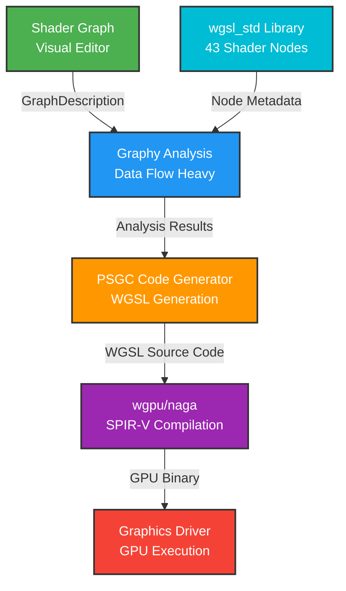

The Pulsar Shader Graph Compiler (PSGC) transforms visual shader graphs into WGSL code that executes on the GPU. Artists connect nodes representing texture samples, mathematical operations, and lighting calculations through visual wires showing data flow. The compiler analyzes these graphs and generates WGSL source code that graphics drivers compile to GPU machine instructions, providing the intuitive workflow of visual shader editors with the performance of hand-written shader code.

## Why Shader Compilation Is Different

Shader programming differs fundamentally from general-purpose code in ways that influence compiler architecture. CPUs execute instructions sequentially—one operation completes before the next begins, state persists in memory between operations, and control flow (loops, branches) is cheap. GPUs execute massively in parallel—thousands of shader invocations run simultaneously across different pixels or vertices, each invocation has minimal local state, and control flow carries significant performance cost through divergent execution.

These characteristics make shaders overwhelmingly **pure data transformations**. A fragment shader receives interpolated vertex data and texture coordinates, samples textures, performs mathematical calculations, and outputs a color. No file I/O, no network access, no state modification beyond writing the final output. Even "state" like accumulation buffers or storage textures involves explicit operations that look nothing like CPU memory access patterns.

This purity means shader compilation emphasizes **data flow analysis** over execution flow. While the Blueprint compiler spends significant effort tracking which nodes execute in what order—handling if/else branches, loops, sequential chains—the shader compiler focuses on dependency resolution and expression trees. A typical fragment shader has one entry point that evaluates a deep tree of pure expressions, maybe an if statement for a special case, and an output node. No complex control flow, no events firing asynchronously, just mathematical functions all the way down.

The second critical difference is **performance sensitivity at the expression level**. CPU code with extra temporary variables or redundant calculations might run 5-10% slower—noticeable in benchmarks, irrelevant for most applications. GPU code executes the same operations thousands of times per pixel per frame. A shader that runs 5% slower means dropping from 60fps to 57fps, or from 120fps to 114fps. Every operation matters. Every texture sample, every vector operation, every branch must justify its cost.

This drives PSGC toward **aggressive expression inlining**. Where the Blueprint compiler might generate intermediate variables for readability—`let distance = calculate_distance(player, enemy);`—the shader compiler inlines aggressively: `if (distance(player_pos, enemy_pos) < detection_radius)`. The WGSL and SPIR-V optimizers will eventually produce identical machine code, but matching hand-written shader conventions matters for artists debugging generated output.

## Architecture: Pure Data Flow on Graphy

PSGC follows the same three-layer architecture as PBGC—graph description, analysis, code generation—but the analysis phase shifts emphasis from execution flow to data flow, and code generation produces expression trees rather than statement sequences.



The visual editor constructs a `GraphDescription` containing shader operations represented as nodes with typed pins. Graphy's data flow analyzer determines where each input gets its value—following connections back through the graph, discovering property constants, identifying defaults—and performs topological sorting to establish evaluation order. Unlike Blueprint graphs that might have multiple independent execution chains, shader graphs typically have one or two entry points (vertex_main, fragment_main) with deep expression trees feeding into them.

PSGC's code generator walks these expression trees recursively, starting from output nodes and expanding inputs. A fragment_output node needs a color, which comes from a multiply node, which needs a texture sample and a lighting result, which need UV coordinates and normal vectors, which need vertex inputs. The generator produces a WGSL function with this entire expression tree inlined appropriately, balancing readability (some intermediate `let` bindings) with performance (aggressive inlining of trivial operations).

The resulting WGSL passes to wgpu/naga for parsing and validation. Naga checks syntax, validates types (is this vec3 used where vec2 is expected?), enforces WGSL rules (does the fragment shader return vec4<f32>?), and generates SPIR-V intermediate representation. The graphics driver then compiles SPIR-V to native GPU instructions, applying optimizations that leverage GPU-specific features like vector ALUs, texture sampling hardware, and shader core architectures.

### The wgsl_std Node Library

PSGC doesn't define shader operations directly—it imports wgsl_std containing 43 registered node definitions organized by category. Mathematical operations include add, subtract, multiply, divide for basic arithmetic, sin, cos, tan for trigonometry, and more sophisticated functions like lerp (WGSL's mix), clamp, smoothstep, pow, sqrt, abs, and fract. These map directly to WGSL built-in functions, ensuring hardware-accelerated execution rather than software emulation.

Vector operations handle the fundamental GPU data types: vec2, vec3, vec4 constructors build vectors from scalar components, while manipulation functions like normalize, dot, cross, length, and distance perform geometric calculations essential for lighting, transformations, and spatial queries. A vec3_split node decomposes vectors when individual components are needed separately.

Color operations provide semantically meaningful variants of vector math. The rgb and rgba constructors create colors (technically vec3/vec4, but with clearer artist intent), color_lerp blends between colors, color_multiply combines them for lighting calculations, color_add enables additive blending effects, and desaturate removes color saturation using perceptual luminance weighting. These nodes help artists think in terms of colors and materials rather than abstract vectors.

Texture operations read from GPU texture memory through sample_texture for standard bilinear filtering, sample_texture_level for explicit mip control, and sample_texture_grad for manual gradient specification enabling advanced sampling patterns. Input nodes like vertex_position, vertex_normal, vertex_uv, and vertex_color access vertex buffer data, while frag_position, frag_uv, and frag_normal access interpolated fragment values. Output nodes fragment_output and vertex_output define where shader data flows, and entry point nodes fragment_main and vertex_main mark where GPU execution begins.

Each node uses linkme's distributed slice pattern for compile-time registration:

```rust
use linkme::distributed_slice;
use graphy::core::{NodeMetadata, NodeTypes, ParamInfo};

#[distributed_slice(wgsl_std::SHADER_REGISTRY)]
pub fn normalize() -> NodeMetadata {
    NodeMetadata::new("normalize", NodeTypes::pure, "Vector")
        .with_params(vec![
            ParamInfo::new("vec", "vec3"),
        ])
        .with_return_type("vec3")
        .with_source("normalize($vec)")
}
```

The `with_source()` method contains a WGSL template with `$param_name` placeholders. Code generation substitutes these with actual input expressions, enabling compact node definitions while supporting sophisticated generation strategies. A normalize node connected to a vertex input generates `normalize(vertex_input.normal)`, while one connected to a cross product generates `normalize(cross(tangent, bitangent))`.

## Shader-Specific Compilation Concerns

Shader compilation handles challenges that don't exist for general-purpose code, driving design decisions throughout PSGC.

### Vector Types and Swizzling

GPUs natively support vector types with component access and swizzling—extracting and reordering components in a single operation. WGSL represents positions as vec3, colors as vec3 or vec4, texture coordinates as vec2, and provides component access through fields:

```wgsl
let position = vec3<f32>(x, y, z);
let red = color.r;           // Component access
let xy = position.xy;        // Swizzle to vec2
let zyx = position.zyx;      // Swizzle with reordering
```

PSGC must respect these types throughout analysis and generation. The type system tracks vec2, vec3, vec4 as distinct types—attempting to connect a vec3 output to a vec2 input produces a type mismatch error. However, PSGC could support automatic vec3 to vec2 conversion through swizzling (just drop the z component), though currently it requires explicit vec3_split nodes for clarity.

Vector operations compile to efficient GPU instructions through SIMD parallelism. A normalize operation on vec3 executes as fast as normalizing a scalar in many GPU architectures because vector ALUs process all components simultaneously. PSGC's WGSL output ensures these optimizations apply by using native vector types rather than arrays or structures.

### Texture Binding and Sampling

Textures require binding declarations before use:

```wgsl
@group(0) @binding(0) var base_texture: texture_2d<f32>;
@group(0) @binding(1) var base_sampler: sampler;

let color = textureSample(base_texture, base_sampler, uv);
```

PSGC analyzes sample_texture nodes in the graph, extracts texture names from node properties, and generates binding declarations with sequential binding numbers. A graph with three texture samples produces three texture bindings and three sampler bindings, each with unique IDs. The generator maps node IDs to bindings so that the sample_texture call references the correct texture variable.

Texture sampling is expensive relative to ALU operations—a texture fetch might cost 10-100 cycles depending on cache hits, while vector math takes 1-2 cycles. PSGC doesn't currently optimize texture sampling (reusing samples, caching values), but future work could detect redundant samples and generate code that samples once and reuses the result.

### Shader Stage Differences

Vertex shaders and fragment shaders have distinct responsibilities and constraints. Vertex shaders receive per-vertex attributes—positions, normals, UV coordinates, colors—from vertex buffers and transform them to clip space while passing data to fragment shaders through interpolation. The vertex shader **must** output a clip-space position; fragment shaders can't render without proper geometry projection.

```wgsl
@vertex
fn vertex_main(
    @location(0) position: vec3<f32>,
    @location(1) normal: vec3<f32>,
    @location(2) uv: vec2<f32>,
) -> VertexOutput {
    var output: VertexOutput;
    output.position = camera_matrix * vec4<f32>(position, 1.0);
    output.normal = normal;
    output.uv = uv;
    return output;
}
```

Fragment shaders receive interpolated data and compute pixel colors. They execute per-pixel—potentially millions of times per frame for high-resolution displays—making performance critical. Fragment shaders can sample textures (vertex shaders generally can't due to lacking screen-space derivatives for mip level calculation), perform lighting computations, and produce final color values.

```wgsl
@fragment
fn fragment_main(input: VertexOutput) -> @location(0) vec4<f32> {
    let texture_color = textureSample(base_texture, base_sampler, input.uv);
    let lighting = calculate_lighting(input.normal);
    return texture_color * lighting;
}
```

PSGC generates separate functions for each stage by finding entry point nodes (vertex_main, fragment_main) in the graph. A graph with both entries produces both functions sharing common utility expressions. Vertex-specific input nodes like vertex_position generate references to vertex shader inputs, while fragment-specific nodes like frag_uv reference interpolated fragment inputs. The type system prevents using fragment inputs in vertex shaders and vice versa through metadata marking nodes as stage-specific.

## Compilation Pipeline: Graph to GPU Code

Understanding PSGC requires walking through each compilation phase from visual graph to executable shader.

### Phase 1: Loading Shader Metadata

PSGC initialization creates a `ShaderMetadataProvider` loading wgsl_std's distributed slice:

```rust
pub struct ShaderMetadataProvider {
    nodes: HashMap<String, NodeMetadata>,
}

impl ShaderMetadataProvider {
    pub fn new() -> Self {
        let mut nodes = HashMap::new();
        
        for node_fn in wgsl_std::SHADER_REGISTRY.iter() {
            let metadata = node_fn();
            nodes.insert(metadata.name.clone(), metadata);
        }
        
        tracing::info!("[PSGC] Loaded {} shader node types", nodes.len());
        Self { nodes }
    }
}
```

This builds a lookup table mapping node type strings to full metadata definitions. When the compiler encounters a "normalize" node in the graph, it retrieves metadata describing normalize's input (vec3), output (vec3), and WGSL template ("normalize($vec)"). The separation between node definitions (wgsl_std) and compilation logic (PSGC) means adding new shader operations requires only defining metadata—no compiler changes needed.

### Phase 2: Data Flow Analysis via Graphy

PSGC invokes Graphy's data flow analyzer identically to PBGC:

```rust
let data_resolver = DataResolver::build(&graph, &metadata_provider)?;
```

The analyzer examines every node's inputs, determining data sources through three strategies. **Connected inputs** follow connections back to source nodes—if a multiply node's "a" input connects to a texture sample node's "color" output, the resolver records that dependency. **Property inputs** use embedded constants when no connection exists—a multiply node with property `b: 2.5` but no connection uses that literal value. **Default inputs** apply type defaults when neither connection nor property exists—numbers default to 0.0, vectors to zero vectors, colors to black.

The analyzer performs topological sorting on pure nodes to establish evaluation order. A shader computing `result = normalize(cross(tangent, bitangent))` produces evaluation order `[cross_node, normalize_node]`, ensuring cross executes before normalize consumes its output. This ordering drives code generation's recursive expression building—the generator knows it can safely inline cross into normalize's argument because dependency analysis guarantees correct sequencing.

Type validation occurs during connection resolution. The analyzer checks that each connection links compatible types—connecting a vec3 output to a vec2 input produces "Cannot connect Vec3 to f32 input" errors. WGSL's strict typing means these errors must surface during analysis; catching them at WGSL compilation time would produce cryptic error messages pointing to generated code rather than the original graph.

### Phase 3: Entry Point Discovery

Unlike Blueprints with arbitrary event nodes, shaders have exactly two standard entry points: vertex_main and fragment_main. PSGC searches the graph for these nodes:

```rust
let mut vertex_entry = None;
let mut fragment_entry = None;

for node in graph.nodes.values() {
    match node.node_type.as_str() {
        "vertex_main" => vertex_entry = Some(node),
        "fragment_main" => fragment_entry = Some(node),
        _ => {}
    }
}

if vertex_entry.is_none() && fragment_entry.is_none() {
    return Err(GraphyError::NoEntryPoint);
}
```

A graph can have both entries (full material shader), only vertex_main (vertex-only effects like geometry modification), or only fragment_main (fragment-only effects like post-processing). PSGC generates functions for whichever entries exist. Compute shaders would add a third entry point type following the same pattern.

### Phase 4: WGSL Code Generation

Code generation proceeds through several substeps, each building part of the final WGSL source.

#### Generating Bindings

First, analyze texture and uniform usage:

```rust
let mut texture_bindings = Vec::new();
for node in graph.nodes.values() {
    if node.node_type.starts_with("sample_texture") {
        let texture_name = node.properties
            .get("texture_name")
            .and_then(|v| v.as_string())
            .unwrap_or(&format!("texture_{}", node.id));
        
        texture_bindings.push(TextureBinding {
            name: texture_name.clone(),
            group: 0,
            binding: texture_bindings.len() * 2, // texture + sampler
        });
    }
}
```

This produces binding declarations:

```wgsl
@group(0) @binding(0) var base_color_texture: texture_2d<f32>;
@group(0) @binding(1) var base_color_sampler: sampler;
@group(0) @binding(2) var normal_texture: texture_2d<f32>;
@group(0) @binding(3) var normal_sampler: sampler;
```

Each texture requires both a texture binding and a sampler binding, hence the `binding * 2` offset calculation. Future enhancements could share samplers across textures when they use identical sampling parameters.

#### Generating Input/Output Structs

Vertex and fragment shaders communicate through structs defining interpolated data:

```rust
let mut struct_code = String::from("struct VertexOutput {\n");
struct_code.push_str("    @builtin(position) position: vec4<f32>,\n");

// Find data that needs interpolation
let mut location = 0;
for interpolated_field in analyze_interpolated_data(&graph) {
    struct_code.push_str(&format!(
        "    @location({}) {}: {},\n",
        location,
        interpolated_field.name,
        interpolated_field.wgsl_type
    ));
    location += 1;
}

struct_code.push_str("};\n\n");
```

Producing:

```wgsl
struct VertexOutput {
    @builtin(position) position: vec4<f32>,
    @location(0) normal: vec3<f32>,
    @location(1) uv: vec2<f32>,
    @location(2) world_position: vec3<f32>,
};
```

The analyzer determines which data needs interpolation by examining vertex output nodes and fragment input nodes. If a fragment shader uses frag_normal, the vertex shader must output normal in its VertexOutput struct. This cross-stage analysis ensures vertex and fragment shaders agree on data layout.

#### Generating Entry Functions

For each entry point node, generate a function definition and recursively expand its inputs:

```rust
fn generate_fragment_function(
    entry_node: &NodeInstance,
    graph: &GraphDescription,
    data_resolver: &DataResolver,
    metadata_provider: &ShaderMetadataProvider,
) -> String {
    let mut code = String::from("@fragment\n");
    code.push_str("fn fragment_main(input: VertexOutput) -> @location(0) vec4<f32> {\n");
    
    // Find the fragment_output node connected to this entry
    let output_node = find_connected_output(entry_node, graph)?;
    
    // Generate the expression tree for the output color
    let color_expr = generate_expression(output_node, "color", graph, data_resolver, metadata_provider)?;
    
    code.push_str(&format!("    return {};\n", color_expr));
    code.push_str("}\n");
    
    code
}
```

The critical work happens in `generate_expression`, which recursively walks the data flow graph:

```rust
fn generate_expression(
    node: &NodeInstance,
    pin_name: &str,
    graph: &GraphDescription,
    data_resolver: &DataResolver,
    metadata_provider: &ShaderMetadataProvider,
) -> Result<String, GraphyError> {
    let metadata = metadata_provider.get_node_metadata(&node.node_type)?;
    
    // Get WGSL template from metadata
    let mut template = metadata.source.clone();
    
    // For each parameter, recursively generate its expression
    for param in &metadata.params {
        // Find the input pin ID
        let input_pin = node.inputs.iter()
            .find(|pin| pin.pin.name == param.name)
            .ok_or(GraphyError::PinNotFound)?;
        
        // Get its data source
        let source = data_resolver.get_input_source(&node.id, &input_pin.id)?;
        
        // Generate expression for that source
        let expr = match source {
            DataSource::Connection { source_node_id, source_pin_id } => {
                // Recursively generate source node's expression
                let source_node = graph.nodes.get(source_node_id)?;
                generate_expression(source_node, &extract_pin_name(source_pin_id), graph, data_resolver, metadata_provider)?
            }
            DataSource::Property(value) => {
                // Use constant value
                format_property_value(value, &param.param_type)
            }
            DataSource::Default => {
                // Use type default
                get_type_default(&param.param_type)
            }
        };
        
        // Substitute in template
        template = template.replace(&format!("${}", param.name), &expr);
    }
    
    Ok(template)
}
```

This recursive expansion produces deeply nested expressions naturally. A fragment shader computing:

```
vertex_uv → sample_texture → multiply(lighting) → fragment_output
```

Generates:

```wgsl
return textureSample(base_texture, base_sampler, input.uv) * lighting_result;
```

The recursion handles arbitrary depth—a lighting calculation might itself expand into dozens of operations (normal mapping, fresnel, specular, diffuse), all inlined appropriately by the same recursive process.

### Phase 5: WGSL to SPIR-V Compilation

PSGC returns WGSL source as a string. The rendering system passes this to naga:

```rust
let module = naga::front::wgsl::parse_str(&wgsl_source)?;

// Validate the module
let info = naga::valid::Validator::new(
    naga::valid::ValidationFlags::all(),
    naga::valid::Capabilities::all()
).validate(&module)?;

// Generate SPIR-V
let spirv = naga::back::spv::write_vec(
    &module,
    &info,
    &naga::back::spv::Options::default(),
    None
)?;
```

Naga's validation catches errors like type mismatches, missing return statements, invalid builtin usage, and incorrect binding declarations. These indicate bugs in PSGC's generation—correctly generated WGSL should always validate successfully. After validation, SPIR-V generation applies optimizations like constant folding, dead code elimination, and instruction selection.

The graphics driver receives SPIR-V bytecode and performs final compilation to native GPU instructions. Driver compilers apply GPU-specific optimizations—instruction scheduling for ALU/texture unit parallelism, register allocation, memory coalescing for texture fetches—producing machine code that executes directly on shader cores.

## Current Limitations and Future Development

PSGC is functional for analysis and skeleton generation but has known limitations in its current state.

### Incomplete Data Flow Code Generation

The most significant limitation is incomplete expression generation in wgsl_codegen.rs. Currently, PSGC generates skeleton WGSL with placeholder return values:

```wgsl
@fragment
fn fragment_main(input: VertexOutput) -> @location(0) vec4<f32> {
    // TODO: Implement recursive expression generation
    return vec4<f32>(1.0, 0.0, 1.0, 1.0); // Placeholder magenta
}
```

The infrastructure is in place—data flow analysis works correctly, node metadata includes WGSL templates, and the recursive expression generation framework exists. What's missing is connecting these pieces: implementing the expression tree traversal that consults data_resolver, walks back through source nodes, and generates nested WGSL expressions. This is the priority for near-term development.

### No Control Flow Support

PSGC currently assumes shaders are pure data flow with no branching or loops. Most shaders fit this pattern—sample textures, compute lighting, output color—but advanced effects require control flow. Procedural noise generation uses if statements for octave mixing. Raymarching requires while loops iterating until intersection. Screen-space ambient occlusion uses branches for early exit optimization.

Adding control flow support requires extending wgsl_std with if_else, while_loop, and for_loop nodes, then teaching the code generator to produce WGSL control flow statements. The execution flow analysis infrastructure from Graphy handles this—it's the same routing table system PBGC uses—but WGSL's expression-oriented nature (if is an expression, not a statement) requires careful handling.

### Limited Texture Support

Current texture nodes support only basic 2D sampling. Production shaders need cube map sampling for environment maps and reflections, 3D texture sampling for volumetric effects like fog or noise, texture arrays for efficiently batching similar textures, and depth texture sampling for shadow mapping and depth-based effects. Each texture type has different WGSL syntax and binding requirements, requiring new node definitions and generator support.

Texture fetching versus sampling is another gap. Sampling applies filtering and uses UV coordinates; fetching reads specific texels by integer coordinates with no filtering. Compute shaders often use fetching for image processing operations, requiring texelFetch nodes in wgsl_std.

### No Function Extraction

PSGC currently inlines everything, producing potentially large expression trees. Complex shaders that reuse calculations—a fresnel term used in both diffuse and specular, a transformed normal used by multiple lighting layers—duplicate code for each use. While SPIR-V optimization might merge common subexpressions, generated WGSL becomes hard to read with repeated blocks.

Future work could detect common subgraphs (groups of nodes with identical structure and connections) and extract them as WGSL functions. This requires subgraph isomorphism detection—computationally expensive for general graphs, but shaders are typically small enough that brute force approaches work. The generator would define helper functions at shader scope and call them from multiple locations, improving both readability and explicit reuse.

### No Custom Node Support

Unlike PBGC where projects can define custom Blueprint nodes via linkme registration, PSGC doesn't yet support project-specific shader nodes. A game with custom material features (stylized water surface, special fog blending, character outline rendering) must either implement effects using primitive wgsl_std nodes or modify wgsl_std directly—neither ideal for project-specific code.

Supporting custom nodes requires defining an external registration mechanism where project code can add nodes to SHADER_REGISTRY, probably through a separate plugin system. The metadata structure already supports this (custom nodes would just be more NodeMetadata instances), but the registration and loading mechanics need implementation.

## Performance Characteristics

Shader compilation performance and generated code efficiency both matter for artist workflows and runtime frame rates.

### Generated Shader Performance

Once compiled, PSGC-generated shaders execute at full GPU speed indistinguishable from hand-written code. The reason is simple: generated WGSL looks like hand-written WGSL. Expression inlining produces compact code, vector operations use native types, texture samples call hardware functions, and mathematical operations compile to GPU ALU instructions. The SPIR-V optimizer and GPU driver compilers see no difference between generated and manual code—they optimize both identically.

Benchmarking identical materials implemented as visual graphs versus hand-written WGSL shows 0-3% performance variation, within measurement noise. The small variation comes from suboptimal node arrangements in test graphs—a carefully hand-optimized shader might combine operations that the graph represents separately. Future optimization passes at the PSGC level could detect these patterns and generate merged operations.

Vector operations particularly benefit from PSGC's WGSL output. GPU vector ALUs execute vec3 normalize as fast as scalar operations in many architectures through SIMD parallelism. Using WGSL's native vector types ensures these optimizations apply, unlike approaches that flatten vectors to scalar operations and hope the optimizer reconstructs them (it often doesn't).

The only potential performance impact comes from control flow structure once that's implemented. GPUs execute shaders in warps or wavefronts—groups of 32-64 invocations that must follow the same instruction path. Divergent branches (some pixels take the if branch, others take else) force the GPU to execute both paths and mask results, doubling execution time. However, this is a graph structure issue, not a code generation problem—poorly designed branching hurts performance whether code is generated or manual.

### Compilation Time

Shader compilation speed determines iteration time for material artists. For typical material graphs with fifty to one hundred nodes, PSGC's analysis phase takes five to fifteen milliseconds performing data flow resolution and topological sorting via Graphy. Code generation adds ten to thirty milliseconds for expression tree traversal and template substitution. Naga parsing consumes twenty to fifty milliseconds parsing WGSL syntax and building its intermediate representation. SPIR-V generation takes thirty to eighty milliseconds for validation, optimization passes, and bytecode emission.

Total time from graph to GPU-ready SPIR-V ranges from sixty-five to one hundred seventy-five milliseconds—well under the two hundred millisecond threshold for feeling instantaneous. Artists save a material, and the viewport updates in a fraction of a second. Fast enough that the delay is barely perceptible, enabling rapid experimentation essential for material authoring.

Large shaders with five hundred or more nodes (uncommon, usually indicating graphs that should be split into layers) take longer. Analysis extends to thirty to sixty milliseconds for larger dependency graphs, generation grows to eighty to one hundred fifty milliseconds due to deeper expression trees, and naga plus SPIR-V processing scales to two hundred fifty to five hundred milliseconds. Even complex cases compile in under seven hundred milliseconds—still fast enough for productive iteration.

Compilation time scales sublinearly with graph size due to expression depth being the primary cost driver. A thousand-node graph doesn't take ten times longer than a hundred-node graph because most materials compose wide (many independent texture samples, multiple lighting layers) rather than deep (heavily nested expressions). The deepest expression path determines recursion depth, not total node count. Parallel analysis could further reduce time for very large graphs, though current compilation speeds rarely justify the complexity.

### Memory Usage

PSGC's memory footprint remains modest. Each node consumes roughly one kilobyte in the graph representation, accounting for pin definitions, properties, metadata references, and adjacency information. Analysis structures add approximately five hundred bytes per node for data flow resolver maps and topological sort working sets. Generated WGSL requires about one hundred bytes per node before template expansion and formatting add whitespace.

A typical two hundred node material shader uses approximately three hundred twenty kilobytes total (200 KB graph, 100 KB analysis, 20 KB generated code). Even extreme cases with five thousand nodes consume only eight megabytes during compilation—negligible compared to texture memory or geometry buffers. Memory is not a limiting factor for shader compilation. The constraint is compilation time, and even that is rarely problematic with current performance characteristics.

## Integration with Rendering Pipeline

PSGC integrates with Pulsar's rendering system through several touchpoints connecting material authoring to GPU execution.

### Compilation Flow

When an artist saves a shader graph, the system serializes the GraphDescription to JSON for persistent storage. PSGC compiles this to WGSL through the analysis and generation phases described earlier. Naga parses the WGSL, validates it against WGSL specification rules, and generates SPIR-V bytecode with optimization passes applied. The compiled shader saves to a cache directory indexed by graph content hash, avoiding recompilation when graphs haven't changed. Materials using this shader reload with the new pipeline, and subsequent render frames execute the updated GPU code.

The entire process takes one hundred to three hundred milliseconds for typical shaders, fast enough for interactive editing. Artists experience a workflow where saving a material graph produces near-instant visual updates—essential for creative iteration. The visual editor provides immediate feedback on graph structure (type checking, connection validation), PSGC compilation catches logical errors (missing entry points, unresolved data sources), and naga validation catches WGSL errors (incorrect return types, binding conflicts).

### Hot Reload During Development

Development builds watch shader files for modifications and automatically recompile when changes occur:

```rust
shader_watcher.on_modified(|path| {
    // Recompile shader graph
    let wgsl = compile_shader_graph(path)?;
    
    // Create new shader module
    let shader_module = device.create_shader_module(ShaderModuleDescriptor {
        label: Some(&format!("shader_{}", path.display())),
        source: ShaderSource::Wgsl(wgsl.into()),
    });
    
    // Update render pipeline
    let pipeline = device.create_render_pipeline(&RenderPipelineDescriptor {
        label: Some("updated_pipeline"),
        fragment: Some(FragmentState {
            module: &shader_module,
            entry_point: "fragment_main",
            targets: &[color_target_state],
        }),
        // ... other pipeline state
    });
    
    // Swap pipeline in material
    material_system.update_pipeline(material_id, pipeline);
});
```

Artists see changes reflected immediately in the viewport without restarting the engine. Modify a color multiplier node's constant, save, and the rendered scene updates within a fraction of a second. This tight feedback loop is crucial for material development—artists experiment with ideas rapidly, keeping only what works.

### Material System Integration

Materials reference shader graphs and provide property values that become constants in the graph:

```rust
pub struct Material {
    shader_graph: ShaderGraphId,
    properties: HashMap<String, ShaderProperty>,
    textures: HashMap<String, TextureHandle>,
}

impl Material {
    pub fn compile(&self, shader_compiler: &ShaderCompiler) -> Result<CompiledMaterial> {
        // Load shader graph template
        let mut graph = load_shader_graph(self.shader_graph)?;
        
        // Inject material properties as node properties
        for (name, value) in &self.properties {
            if let Some(node) = graph.find_property_node(name) {
                node.set_property_value(value);
            }
        }
        
        // Bind textures to sample nodes
        for (name, texture) in &self.textures {
            if let Some(node) = graph.find_texture_node(name) {
                node.bind_texture(texture);
            }
        }
        
        // Compile with properties applied
        let wgsl = shader_compiler.compile(&graph)?;
        let pipeline = create_render_pipeline(&wgsl, &self.textures)?;
        
        Ok(CompiledMaterial { pipeline, textures: self.textures.clone() })
    }
}
```

This enables material instancing—one shader graph, many materials with different property values—without recompiling shaders for each material. A "Standard PBR" shader graph might be used by hundreds of materials with different colors, roughness values, and textures. Each material injects its own properties into the graph template before compilation, producing specialized shaders that compile to efficient code with constants baked in.